# Pokemon Tactics

Un jeu de combat tactique sur grille isométrique fusionnant **Pokemon** et **Final Fantasy Tactics Advance**, développé en TypeScript.

> **Statut : Phase 0 — POC en cours.** Le moteur de combat fonctionne, le renderer affiche un combat hot-seat jouable dans le navigateur.

## Le jeu

Pokemon Tactics transpose les combats Pokemon sur une grille tactique inspirée de FFTA :

- **Grille isométrique** avec dénivelés, terrains interactifs et aires d'effet
- **Système Pokemon** : stats officielles, 18 types, STAB, statuts, 4 attaques par Pokemon
- **Initiative individuelle** : chaque Pokemon agit selon sa vitesse (pas de tour par équipe)
- **Friendly fire** : les AoE touchent les alliés, le positionnement compte
- **Jusqu'à 12 Pokemon / 12 joueurs** en hot-seat (équipes ou free-for-all)
- **Jouable par des humains ou des IA** (classique, LLM, ou via MCP)

### Ce qui fonctionne aujourd'hui

- Moteur de combat complet : déplacement BFS, 7 patterns de ciblage, calcul de dégâts Gen 5+, STAB, efficacité des types, statuts (brulure, poison, paralysie, gel, sommeil), drain Vampigraine, KO, victoire
- Renderer Phaser 4 : grille isométrique 12x12, sprites placeholder, hot-seat 2 joueurs, animations, UI de combat
- 190+ tests, 100% coverage sur le core
- IA headless validée (random + heuristique)

## Stack technique

| | |
|---|---|
| Langage | TypeScript (strict) |
| Moteur de jeu | Core pur TypeScript (zero dependance UI) |
| Rendu | Phaser 4 (2D isometrique) |
| Tests | Vitest (core) + Playwright (rendu) |
| Bundler | Vite |
| Linter/Formatter | Biome |
| Monorepo | pnpm workspaces |

## Structure

```
packages/
  core/        Moteur de jeu pur (logique, calculs, grille)
  renderer/    Interface graphique (Phaser 4)
  data/        Donnees Pokemon (stats, moves, type chart, overrides)
docs/          Documentation du projet
plans/         Plans d'execution numerotes
```

## Demarrage rapide

```bash
pnpm install
pnpm dev          # Lance le jeu en dev (Vite)
pnpm test         # Tests unitaires (Vitest)
pnpm test:all     # Tous les tests (unit + integration + scenario)
pnpm lint         # Lint + format (Biome)
```

## Documentation

- [Game Design](docs/game-design.md) — Vision, regles de combat, mecaniques
- [Architecture](docs/architecture.md) — Architecture technique, stack, principes
- [Decisions](docs/decisions.md) — Log des decisions prises et questions ouvertes
- [Roadmap](docs/roadmap.md) — Phases de developpement, POC vers polish
- [Methodologie](docs/methodology.md) — Comment on travaille (humain + Claude Code)
- [References](docs/references.md) — Projets open source d'inspiration

## Construit avec l'IA

Ce projet est une experience de developpement assiste par IA. Le createur humain est **directeur creatif et architecte** — il ne code pas. [Claude Code](https://claude.com/claude-code) (Anthropic) est le **developpeur principal** : il ecrit le code, les tests, la documentation, et gere les plans d'execution.

Le repo sert aussi de terrain d'experimentation pour le travail avec une **equipe d'agents IA specialises**. Chaque agent a un role precis et se declenche automatiquement selon le contexte :

```mermaid
flowchart TB
    subgraph triggers["Declencheurs"]
        modCore["Modif packages/core/"]
        modMecanique["Modif mecaniques de jeu"]
        modData["Modif donnees Pokemon"]
        modAssets["Modif assets"]
        modDeps["Ajout dependance"]
        modAgent["Modif agent/skill"]
        modCI["Modif CI/pipeline"]
        finPlan["Fin d'un plan"]
        finSession["Fin de session"]
        bug["Bug complexe"]
        hesitation["Hesitation approche"]
    end

    subgraph agents["Agents"]
        coreGuardian["core-guardian\n(zero dependance UI)"]
        testWriter["test-writer\n(tests Vitest)"]
        gameDesigner["game-designer\n(equilibre mecaniques)"]
        codeReviewer["code-reviewer\n(qualite + commit msg)"]
        docKeeper["doc-keeper\n(documentation)"]
        sessionCloser["session-closer\n(STATUS.md)"]
        depManager["dependency-manager\n(audit deps)"]
        assetManager["asset-manager\n(conventions assets)"]
        agentManager["agent-manager\n(audit agents)"]
        ciSetup["ci-setup\n(GitHub Actions)"]
        debugger_["debugger\n(diagnostic)"]
        bestPractices["best-practices\n(recherche)"]
        dataMiner["data-miner\n(donnees Pokemon)"]
        perfProfiler["performance-profiler\n(FPS, bundle)"]
    end

    modCore --> coreGuardian
    modCore --> testWriter
    modMecanique --> gameDesigner
    modData --> gameDesigner
    modData --> dataMiner
    finPlan --> codeReviewer
    finPlan --> docKeeper
    finSession --> sessionCloser
    modDeps --> depManager
    modAssets --> assetManager
    modAgent --> agentManager
    modCI --> ciSetup
    bug --> debugger_
    hesitation --> bestPractices

    codeReviewer -->|"si core touche"| coreGuardian
    codeReviewer -->|"si mecaniques"| gameDesigner
    sessionCloser -->|"verifie"| docKeeper
```



### Agents disponibles

| Agent | Role | Modele |
|-------|------|--------|
| `core-guardian` | Verifie que le core n'a aucune dependance UI | Haiku |
| `code-reviewer` | Review qualite, conventions, propose un commit message | Sonnet |
| `test-writer` | Ecrit les tests Vitest (test-first) | Sonnet |
| `doc-keeper` | Maintient toute la documentation a jour | Sonnet |
| `game-designer` | Coherence et equilibre des mecaniques | Sonnet |
| `session-closer` | Met a jour STATUS.md en fin de session | Sonnet |
| `data-miner` | Extrait les donnees Pokemon (Showdown/PokeAPI) | Sonnet |
| `dependency-manager` | Audit dependances, vulnerabilites, deprecations | Sonnet |
| `asset-manager` | Conventions et pipeline des assets | Sonnet |
| `best-practices` | Recherche bonnes pratiques du marche | Sonnet |
| `debugger` | Diagnostic avance de bugs complexes | Opus |
| `ci-setup` | Configuration GitHub Actions | Sonnet |
| `performance-profiler` | Analyse performances (FPS, memoire, bundle) | Sonnet |
| `agent-manager` | Meta-agent qui audite les autres agents | Sonnet |
| `plan-reviewer` | Cree et review les plans d'execution | Sonnet |
| `visual-analyst` | Analyse visuels de jeux pour inspiration | Sonnet |

## Sources et credits

### Donnees Pokemon

| Source | Usage |
|--------|-------|
| [Pokemon Showdown](https://github.com/smogon/pokemon-showdown) | Stats, moves, type chart, formules de degats |
| [PokeAPI](https://pokeapi.co/) | Donnees Pokemon complementaires (height/weight) |
| [Bulbapedia](https://bulbapedia.bulbagarden.net/) | Documentation formules (degats, types, statuts) |
| [pokemon-showdown-fr](https://github.com/Sykless/pokemon-showdown-fr) | Traductions francaises (noms Pokemon, moves, statuts) — i18n Phase 2 |

### Sprites

| Source | Usage | Licence |
|--------|-------|---------|
| [PMDCollab/SpriteCollab](https://github.com/PMDCollab/SpriteCollab) | Sprites Pokemon + portraits (8 directions, animations) | CC BY-NC 4.0 |
| [PokeSprite](https://github.com/msikma/pokesprite) | Icones Pokemon pour l'UI | MIT |

Voir [CREDITS.md](CREDITS.md) pour les credits detailles par Pokemon et artiste.

### Projets d'inspiration

| Projet | Interet |
|--------|---------|
| [Pokemon Showdown (sim/)](https://github.com/smogon/pokemon-showdown) | Architecture moteur de combat decoupled |
| [PokeRogue](https://github.com/pagefaultgames/pokerogue) | Stack Phaser + TS + Vitest + Biome + pnpm |
| [Grid Engine](https://github.com/Annoraaq/grid-engine) | Librairie grille isometrique TypeScript |
| [godot-tactical-rpg](https://github.com/ramaureirac/godot-tactical-rpg) | Patterns game design tactical RPG |

### Outils

| Outil | Usage |
|-------|-------|
| [Claude Code](https://claude.com/claude-code) | Developpeur principal (Anthropic) |
| [Phaser 4](https://phaser.io/) | Moteur de rendu 2D |
| [Vite](https://vite.dev/) | Bundler |
| [Vitest](https://vitest.dev/) | Tests unitaires |
| [Biome](https://biomejs.dev/) | Linter et formatter |

## Disclaimers

### Propriete intellectuelle

Ce projet est un **fan-game non commercial** realise a des fins educatives et experimentales. Pokemon, les noms de Pokemon, et tous les elements associes sont des marques deposees de **Nintendo, Game Freak et The Pokemon Company**. Ce projet n'est ni affilie, ni endosse, ni sponsorise par ces entreprises. Aucun profit n'est tire de ce projet. Si les ayants droit demandent le retrait de ce projet, il sera retire immediatement.

### Intelligence artificielle

La quasi-totalite du code, des tests et de la documentation de ce projet a ete generee par **Claude Code** (Anthropic). Le createur humain agit en tant que directeur creatif et architecte — il guide, review et valide, mais n'ecrit pas le code lui-meme. Ce repo sert egalement de terrain d'experimentation pour le developpement assiste par une equipe d'agents IA specialises.

## Licence

A definir. Ce projet est actuellement en developpement prive.
