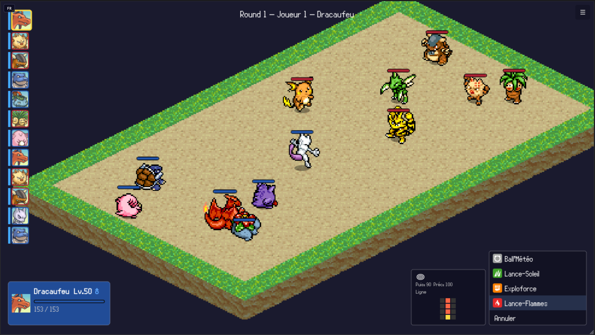

# Pokemon Tactics

A tactical combat game on an isometric grid, fusing **Pokemon** and **Final Fantasy Tactics**, built in TypeScript.

> **Status: Playable demo** — 15 Pokemon (final evolutions), 102 moves, AI opponents, hot-seat up to 12 players.



## Progression

| | Implemented | Target pool | Details |
|---|---|---|---|
| Pokemon | **15 / 151** | 151 Gen 1 | [full list](docs/implementations.md#pokemon-gen-1--151) |
| Moves | **102** | 481 (Gen 1) | [full list](docs/implementations.md#attaques-102-implémentées) |
| Abilities | **28** | 114 (Gen 1) | [full list](docs/implementations.md#talents-28-implémentés) |
| Held items | **12** | ~159 | [full list](docs/implementations.md#objets-tenus-12-implémentés) |

## The Game

Pokemon Tactics brings Pokemon battles to a tactical grid inspired by FFTA:

- **Isometric grid** with areas of effect and positioning that matters
- **Pokemon system** — official stats, 18 types, STAB, status conditions, 4 moves per Pokemon
- **Charge Time system** — Speed determines action frequency (FFX/FFTA-style CT), switchable to classic round-robin
- **Friendly fire** — AoE hits allies too, think before you blast
- **Up to 12 players** in hot-seat (teams or free-for-all)
- **AI opponents** with difficulty levels (easy / medium / hard)

## Getting Started

```bash
pnpm install
pnpm dev
```

Open http://localhost:5173 in your browser.

**Or play online at [kekel87.github.io/pokemon-tactics](https://kekel87.github.io/pokemon-tactics/)**

## Tech Stack

| | |
|---|---|
| Language | TypeScript (strict) |
| Game engine | Pure TypeScript core (zero UI dependency) |
| Renderer | Phaser 4 (2D isometric) |
| Tests | Vitest (700+ tests) |
| Bundler | Vite |
| Linter | Biome |
| Monorepo | pnpm workspaces |

## Project Structure

```
packages/
  core/        Pure game engine (logic, calculations, grid)
  renderer/    Visual interface (Phaser 4)
  data/        Pokemon data (stats, moves, type chart)
docs/          Game design, architecture, decisions, roadmap
```

## Feedback

This is a personal side project built in my spare time. I welcome feedback, bug reports and feature ideas — I'll address them when I can.

- [Report a bug](../../issues/new?template=bug_report.yml)
- [Request a feature](../../issues/new?template=feature_request.yml)
- [General feedback](../../issues/new?template=general_feedback.yml)

## Built with AI

This project is an AI-assisted development experiment. The human creator is **creative director and architect** — he doesn't write code. [Claude Code](https://claude.com/claude-code) (Anthropic) is the **lead developer**: it writes the code, tests, documentation, and manages execution plans, assisted by a team of 20+ specialized AI agents.

## Credits

### Pokemon Data

| Source | Usage |
|--------|-------|
| [Pokemon Showdown](https://github.com/smogon/pokemon-showdown) | Stats, moves, type chart, damage formulas |
| [PokeAPI](https://pokeapi.co/) | Complementary Pokemon data |
| [Bulbapedia](https://bulbapedia.bulbagarden.net/) | Formula documentation |
| [pokemon-showdown-fr](https://github.com/Sykless/pokemon-showdown-fr) | French translations |

### Sprites

| Source | License |
|--------|---------|
| [PMDCollab/SpriteCollab](https://github.com/PMDCollab/SpriteCollab) | CC BY-NC 4.0 |
| [PokeSprite](https://github.com/msikma/pokesprite) | MIT |
| [Pokepedia](https://www.pokepedia.fr/) | Type & status icons |
| [Bulbagarden](https://archives.bulbagarden.net/) | Category icons (Sword & Shield) |
| [ICON Isometric Pack — Jao](https://jao-itch.itch.io/icon-isometric-pack) | Isometric arena tileset (32×32px) |

See [CREDITS.md](CREDITS.md) for detailed per-Pokemon sprite credits.

### Inspiration

**Games** — Pokemon Conquest · Final Fantasy Tactics · Fire Emblem · Advance Wars · Triangle Strategy · Dofus · Pokemon Mystery Dungeon

**Open source** — [Pokemon Showdown](https://github.com/smogon/pokemon-showdown) · [PokeRogue](https://github.com/pagefaultgames/pokerogue) · [Grid Engine](https://github.com/Annoraaq/grid-engine) · [godot-tactical-rpg](https://github.com/ramaureirac/godot-tactical-rpg)

## Disclaimers

**Intellectual property** — This is a **non-commercial fan game** made for educational and experimental purposes. Pokemon and all related properties are trademarks of **Nintendo, Game Freak and The Pokemon Company**. This project is not affiliated with, endorsed, or sponsored by these companies. If rights holders request removal, it will be taken down immediately.

**Artificial intelligence** — Nearly all code, tests, and documentation in this project were generated by **Claude Code** (Anthropic). The human creator acts as creative director and architect — he guides, reviews, and validates, but does not write the code himself.

## License

Code is licensed under [MIT](LICENSE). Pokemon sprites are from PMDCollab under [CC BY-NC 4.0](https://creativecommons.org/licenses/by-nc/4.0/) — see [CREDITS.md](CREDITS.md) for details.
