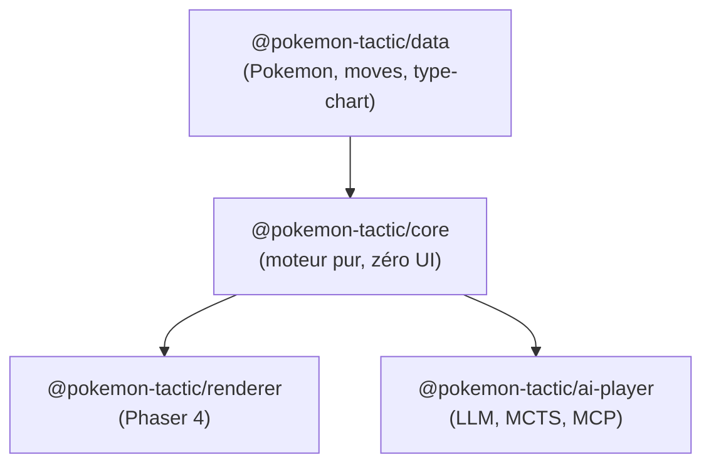
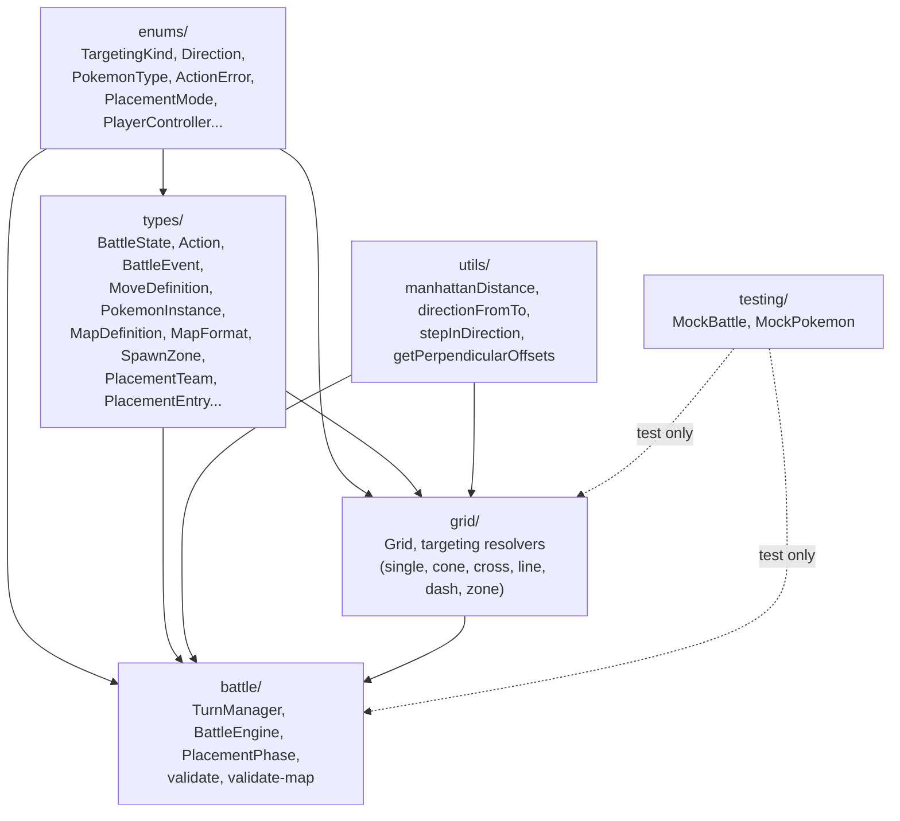
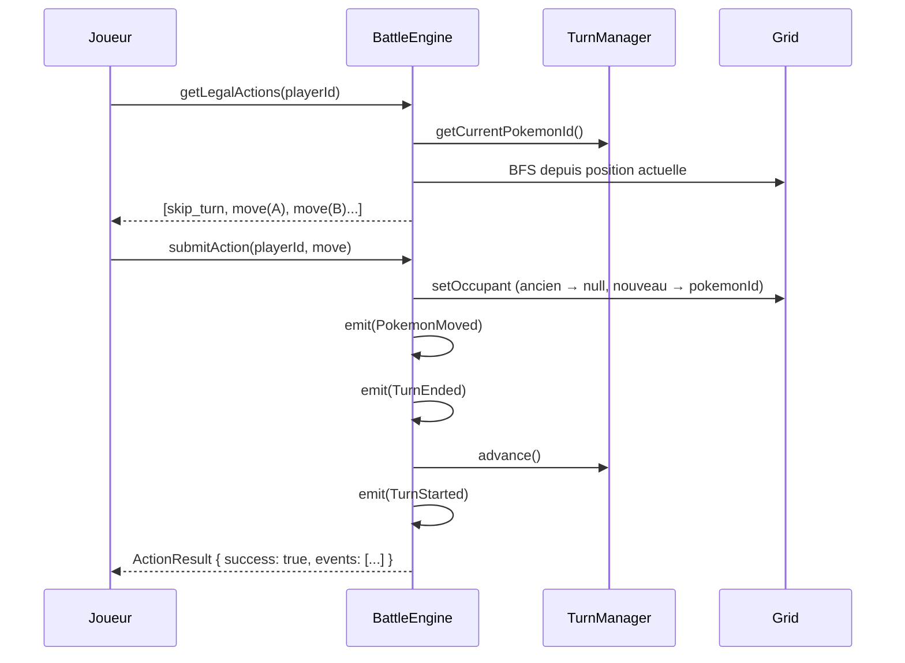
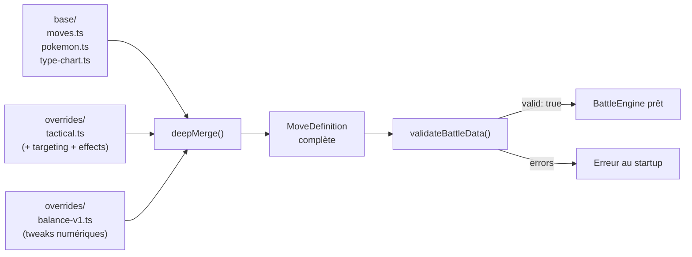

# Architecture technique — Pokemon Tactics

> Pour le game design, voir [game-design.md](game-design.md).
> Pour les décisions, voir [decisions.md](decisions.md).

---

## 1. Principe fondamental : moteur découplé du rendu

```
┌──────────────────────────────────────────────────┐
│                   @core                           │
│  (logique pure — ZERO dépendance UI/rendu)        │
│                                                   │
│  - État du combat (grille, Pokemon, tours)          │
│  - Calculs (dégâts, types, portée, AoE, LOS)     │
│  - Pathfinding, initiative                        │
│  - Validation des actions                         │
│  - Génération du log de combat (replay)           │
│                                                   │
│  API : recevoir des actions, retourner un état    │
└───────────┬──────────────┬───────────────┬────────┘
            │              │               │
 ┌──────────▼──┐   ┌──────▼──────┐  ┌─────▼─────────┐
 │  @renderer  │   │ @ai-player  │  │  Text / CLI   │
 │  (Phaser)   │   │ (LLM, MCTS, │  │  (debug,      │
 │             │   │  MCP server) │  │   replay,     │
 │             │   │              │  │   tests)      │
 └─────────────┘   └─────────────┘  └───────────────┘
```

**Avantages :**
- Changer de renderer sans toucher à la logique (Phaser → Three.js → Godot)
- Faire jouer des IA sans interface graphique
- Tests unitaires sur la logique pure
- Mode headless : 1000 combats en quelques secondes (équilibrage)
- Replays rejouables dans n'importe quel renderer

### Diagramme des packages



---

## 2. Stack

| | |
|---|---|
| Langage | TypeScript (strict mode) |
| Runtime | Node.js (dev/tests/AI) + Navigateur (jeu) |
| Bundler | Vite |
| Renderer | Phaser 4 (→ Three.js possible plus tard pour HD-2D avancé) |
| Tests | Vitest (core) + Playwright (rendu) |
| Linter/Formatter | Biome (remplace ESLint + Prettier + Stylelint) |
| Package manager | pnpm |
| Monorepo | pnpm workspaces |
| Versionning | Git + conventional commits |

---

## 3. Structure monorepo

```
pokemon-tactics/
├── packages/
│   ├── core/                    # Moteur de jeu pur (ZERO dépendance UI)
│   │   ├── src/
│   │   │   ├── enums/           # Const object enums (PokemonType, Direction, TargetingKind...)
│   │   │   ├── types/           # Interfaces (1 fichier = 1 type)
│   │   │   ├── utils/           # Fonctions pures (math, direction, géométrie)
│   │   │   ├── grid/            # Grid, Pathfinding, Targeting resolvers
│   │   │   ├── battle/          # BattleEngine, TurnManager, effect handlers, turn pipeline
│   │   │   ├── testing/         # Mocks centralisés (MockPokemon...)
│   │   │   └── index.ts         # Barrel export (API publique)
│   │   ├── tsconfig.json        # extends ../../tsconfig.base.json
│   │   └── package.json
│   │
│   ├── renderer/                # Interface graphique (Phaser 4)
│   │   ├── src/
│   │   │   ├── scenes/          # Scènes Phaser (BattleScene + BattleUIScene overlay)
│   │   │   ├── game/            # Orchestration (GameController, BattleSetup, AnimationQueue)
│   │   │   ├── grid/            # Rendu isométrique (IsometricGrid, curseur animé)
│   │   │   ├── sprites/         # Sprites Pokemon (PokemonSprite, SpriteLoader, barres PV)
│   │   │   ├── ui/              # Interface FFT-like (ActionMenu, InfoPanel, TurnTimeline, BattleUI, DirectionPicker, PlacementRosterPanel, MoveTooltip, pattern-preview)
│   │   │   ├── enums/           # Enums renderer (HighlightKind)
│   │   │   ├── constants.ts     # Depth centralisé, couleurs équipe, tailles UI, POKEMON_SPRITE_SCALE
│   │   │   └── main.ts
│   │   ├── public/
│   │   │   └── assets/
│   │   │       ├── sprites/pokemon/{name}/  # atlas.json, atlas.png, portrait-normal.png, credits.txt (générés)
│   │   │       └── ui/
│   │   │           ├── arrows.png           # Spritesheet flèches DirectionPicker
│   │   │           ├── types/               # Type icons Pokepedia ZA (Légendes Pokémon Z-A) : {type}.png, 36x36px sans texte (18 types)
│   │   │           └── categories/          # Category icons Bulbagarden SV : physical.png, special.png, status.png — 50x40px
│   │   ├── index.html
│   │   ├── vite.config.ts
│   │   ├── tsconfig.json        # extends base + DOM libs
│   │   └── package.json
│   │
│   └── data/                    # Données Pokemon (partagées)
│       ├── src/
│       │   ├── base/            # Données officielles (Showdown/PokeAPI)
│       │   ├── overrides/       # Surcharges tactiques + balance
│       │   └── index.ts
│       ├── tsconfig.json        # extends ../../tsconfig.base.json
│       └── package.json
│
├── scripts/                     # Outils de build one-shot (non packagés)
│   ├── extract-sprites.ts       # Pipeline PMDCollab : télécharge sprites → atlas Phaser
│   └── sprite-config.json       # Config extensible (Pokemon, animations, portraits)
├── package.json                 # Workspace root (scripts, devDependencies)
├── pnpm-workspace.yaml
├── tsconfig.base.json           # Config TS partagée (strict, bundler, path aliases)
├── tsconfig.json                # Racine, extends base
├── biome.json                   # Lint + format (recommended + nursery)
├── vitest.config.ts             # Tests + coverage
├── scenarios/              # Combats headless complets (*.scenario.test.ts) — à venir
├── CLAUDE.md
├── CREDITS.md                   # Attribution CC BY-NC 4.0 PMDCollab (artistes par Pokemon)
├── STATUS.md
├── docs/
└── plans/
```

### Organisation du core

Structure flat par responsabilité. On restructurera par domaine quand la complexité le justifiera (Phase 1-2).

| Dossier | Contenu | Tests |
|---------|---------|-------|
| `enums/` | Const object enums (pattern `as const` + type dérivé) — dont `PlacementMode`, `PlayerController` | Non testé (compilation = validation) |
| `types/` | Interfaces, 1 fichier = 1 type — dont `MapDefinition`, `MapFormat`, `SpawnZone`, `PlacementTeam`, `PlacementEntry` | Non testé (compilation = validation) |
| `utils/` | Fonctions pures réutilisables (math, direction, géométrie) | Oui |
| `grid/` | Classe Grid, targeting resolvers | Oui |
| `battle/` | BattleEngine, TurnManager, PlacementPhase, validate, validate-map | Oui |
| `testing/` | Mocks centralisés (`abstract class MockX`) | Exclu du coverage et du build |

### Diagramme interne du core



### Configuration TypeScript

Un seul `tsconfig.base.json` à la racine avec `moduleResolution: "bundler"` et les path aliases. Chaque package hérite via `extends`. Pas de project references, pas de `composite`, pas de `dist/` intermédiaires. Pattern identique à un monorepo Nx/Angular.

---

## 4. Système d'attaques : composition Targeting + Effects

Chaque attaque est **déclarative** (données, pas du code custom). Définie par deux axes :
- **Targeting** : comment on cible (pattern spatial)
- **Effects** : ce qui arrive aux cibles (dégâts, statut, buff, lien...)

```typescript
interface MoveDefinition {
  id: string;
  type: PokemonType;
  category: 'physical' | 'special' | 'status';
  power: number;
  accuracy: number;
  pp: number;
  targeting: TargetingPattern;
  effects: Effect[];
}

// Patterns de ciblage — discriminated union, extensible
type TargetingPattern =
  | { kind: 'single'; range: { min: number; max: number } }
  | { kind: 'self' }
  | { kind: 'cone'; range: { min: number; max: number } }      // largeur = distance * 2 - 1 (pas de paramètre width)
  | { kind: 'cross'; size: number }                             // toujours centré sur le caster, pas de range
  | { kind: 'line'; length: number }
  | { kind: 'dash'; maxDistance: number }
  | { kind: 'zone'; radius: number }
  | { kind: 'slash' }                                           // arc frontal 3 cases, pas de paramètre
  | { kind: 'blast'; range: { min: number; max: number }; radius: number }

// Effets — composables, une attaque peut en avoir plusieurs
type Effect =
  | { kind: 'damage' }
  | { kind: 'status'; status: StatusType; chance: number }
  | { kind: 'stat_change'; stat: Stat; stages: number; target: 'self' | 'targets' }
  | { kind: 'link'; linkType: string; duration: number;
      maxRange: number; drainFraction: number }
```

**Exécution en 3 étapes :**
1. `resolveTargeting(move, caster, targetTile, grid)` → tiles affectées
2. `resolveEffects(move, caster, affectedTiles, state)` → précision, dégâts, statuts
3. `emit(events)` → liste d'événements

Chaque `kind` de targeting a un **resolver** (pure function). Chaque `kind` d'effect a un **processor**.
Ajouter une nouvelle mécanique = ajouter un `kind` dans l'union + son resolver/processor. Pas de refactor.

### Flux d'un tour de combat



---

## 5. Système d'événements : core → renderer

Le core est **synchrone** et émet des événements. Les consommateurs (renderer, replay, IA, CLI) les traitent comme ils veulent.

```typescript
type BattleEvent =
  | { type: 'turn_started'; pokemonId: string }
  | { type: 'move_started'; attackerId: string; moveId: string }
  | { type: 'pokemon_moved'; pokemonId: string; path: Position[] }
  | { type: 'pokemon_dashed'; pokemonId: string; path: Position[]; hitId?: string }
  | { type: 'damage_dealt'; targetId: string; amount: number; effectiveness: number }
  | { type: 'status_applied'; targetId: string; status: StatusType }
  | { type: 'stat_changed'; targetId: string; stat: Stat; stages: number }
  | { type: 'link_created'; sourceId: string; targetId: string; linkType: string }
  | { type: 'link_drained'; sourceId: string; targetId: string; amount: number }
  | { type: 'link_broken'; sourceId: string; targetId: string }
  | { type: 'pokemon_ko'; pokemonId: string; countdownStart: number }
  | { type: 'pokemon_eliminated'; pokemonId: string }
  | ...
```

**Le core n'attend jamais le renderer.** Un `submitAction()` est synchrone :
il mute l'état, émet les events, et retourne. L'IA peut donc jouer des milliers
de parties par seconde sans aucun overhead visuel.

**Le renderer gère sa propre queue d'animations.** Il reçoit les events,
les empile, et les joue séquentiellement avec des tweens/animations Phaser.
Le joueur humain attend la fin des animations avant d'agir.

```
Core (sync)          Renderer (async)         IA (sync)
    │                     │                      │
    ├── emit(events) ────►│ queue + animate       │
    │                     │   await tween...      │
    │                     │   await tween...      │
    │                     │   done → unlock UI    │
    │                     │                      │
    ├── emit(events) ◄───────────────────────────┤ submitAction() → instant
    │                     │                      │
```

Les mêmes events alimentent les **replays** (sérialisation JSON).

---

## 6. Système de surcharge (override) pour l'équilibrage

### Structure des données

```
packages/data/
  base/                    # Données Pokemon officielles (importables de Showdown)
    moves.ts               # power, accuracy, pp, type, category...
    pokemon.ts             # stats, types, poids, movepool...
    type-chart.ts          # 18x18 efficacités

  overrides/
    tactical.ts            # Ajoute targeting + effects (n'existe pas dans Pokemon)
    balance-v1.ts          # Ajustements numériques (PP, chances, portées...)

  maps/                    # Définitions de cartes (MapDefinition)
    poc-arena.ts           # Carte POC 12x12, format 2 joueurs (plan 013)
```

### Merge par couches

```
Données finales = deepMerge(base, tactical, balance)
```

- **base** : données Pokemon pures (power, accuracy, pp, type...)
- **tactical** : ajoute targeting + effects (la couche "grille tactique")
- **balance** : tweaks numériques par-dessus

Les overrides sont **optionnels et additifs**. Changer de balance = changer un fichier.
Permet de proposer des rulesets/métas différents plus tard.

### Pipeline de données



### Validation au startup

Un validateur vérifie au démarrage que chaque entité finale est complète et cohérente :
- Chaque move a un targeting et au moins un effect
- Chaque pokemon référence des moves qui existent
- Les ids sont uniques, pas de référence cassée
- Erreur explicite si une override casse la structure

Léger en coût (ne tourne qu'une fois au boot), gros gain en confiance sur les données.

---

## 7. Pipeline sprites PMDCollab

Les sprites sont extraits depuis [PMDCollab/SpriteCollab](https://github.com/PMDCollab/SpriteCollab) par un script one-shot (`scripts/extract-sprites.ts`), non packagé dans le jeu.

```
PMDCollab GitHub (raw)
  └── AnimData.xml + {Anim}-Anim.png + PortraitSheet.png + credits.txt
        │  (téléchargement + parse fast-xml-parser)
        ▼
scripts/extract-sprites.ts  ←  scripts/sprite-config.json
        │  (découpe frames via sharp, génère atlas)
        ▼
packages/renderer/public/assets/sprites/pokemon/{name}/
  ├── atlas.json          # Phaser atlas descriptor (frames + metadata)
  ├── atlas.png           # Spritesheet combiné (toutes anims + directions)
  ├── portrait-normal.png # Portrait 40x40 (émotion Normal)
  └── credits.txt         # Attribution artiste (CC BY-NC 4.0)
```

**Clés d'animation Phaser** : `{pokemonId}-{anim}-{direction}` (ex : `bulbasaur-idle-south`)

**SpriteLoader** (`packages/renderer/src/sprites/SpriteLoader.ts`) :
- `preloadPokemonAssets(scene, pokemonIds[])` — charge atlas + portrait au preload
- `createAnimations(scene, pokemonId)` — enregistre les animations Phaser depuis les metadata d'atlas

**PokemonSprite** utilise les animations (Idle, Walk, Attack, Hurt, Faint) avec fallback sur cercle coloré si atlas absent.

---

## 8. API du core

Le core expose une interface simple que tout joueur (humain ou IA) utilise :

```typescript
interface BattleEngine {
  // État visible pour le joueur actif
  getGameState(playerId: string): GameState;

  // Actions légales (l'IA itère là-dessus)
  getLegalActions(playerId: string): Action[];

  // Soumettre une action — synchrone, retourne le résultat + events
  submitAction(playerId: string, action: Action): ActionResult;

  // Souscrire aux événements (renderer, replay, debug)
  on(event: string, handler: (e: BattleEvent) => void): void;
}
```

---

## 9. Système de replay

```typescript
interface BattleReplay {
  initialState: BattleState   // état au début (grille, placements, équipes)
  actions: Action[]            // chaque action jouée dans l'ordre
  randomSeed: number           // pour reproduire l'aléatoire (crits, miss...)
}
```

Le replay est **déterministe** : même seed + mêmes actions = même résultat.

---

## 10. Outillage

| Besoin | Solution |
|--------|----------|
| Écrire du code | Agent + TypeScript (natif) |
| Lancer le jeu | `pnpm dev` → Vite dev server |
| Voir le rendu | MCP Playwright — screenshots, interaction |
| Tests | `pnpm test` (Vitest) |
| Faire jouer une IA | Script Node.js important le core |
| Voir un replay | Charger le JSON dans le renderer web |

---

## 11. Évolutions prévues du renderer

| Phase | Renderer | Style |
|-------|----------|-------|
| POC | Phaser 4 (2D isométrique) | Sprites + tiles isométriques |
| HD-2D | **Babylon.js** ou Three.js (spike comparatif prévu) | Terrain 3D + sprites 2D billboardés + DoF/bloom |
| Optionnel | Godot (desktop) | HD-2D natif, rendu Vulkan |

Babylon.js = built-in post-processing (DoF, bloom, tilt-shift), écrit en TypeScript, `NullEngine` pour tests headless.
Three.js = plus léger, plus grande communauté. Spike comparatif quand on atteindra la phase HD-2D.

Le core ne change jamais — seul le renderer est remplacé.

---

## 12. Agents & Skills

Agents custom dans `.vibe/agents/` et skills dans `.vibe/skills/` pour automatiser le workflow.

### Agents actifs

| Agent | Modèle | Rôle |
|-------|--------|------|
| `core-guardian` | devstral-2 | Vérifie que core n'a aucune dépendance UI |
| `doc-keeper` | devstral-2 | Maintient la documentation à jour (checklist systématique sur tous les fichiers doc) |
| `code-reviewer` | devstral-2 | Review qualité, TS strict, conventions — propose un titre de commit après review |
| `game-designer` | sonnet | Cohérence et équilibre des mécaniques |
| `visual-analyst` | sonnet | Analyse visuels + web search pour inspiration |
| `session-closer` | sonnet | Met à jour STATUS.md en fin de session |
| `test-writer` | sonnet | Tests Vitest, approche test-first |
| `data-miner` | sonnet | Import données Pokemon (Showdown/PokeAPI) |
| `dependency-manager` | sonnet | Gestion des dépendances npm — vérifie aussi les deprecation warnings |
| `best-practices` | sonnet | Recherche de bonnes pratiques du marché |
| `asset-manager` | sonnet | Gestion des assets (sprites, tilesets, sons) |
| `plan-reviewer` | sonnet | Crée, review et maintient les plans |
| `performance-profiler` | sonnet | Analyse performances (FPS, mémoire, bundle) |
| `debugger` | opus | Diagnostic de bugs complexes |
| `visual-tester` | sonnet | Vérification visuelle via Playwright MCP (screenshots, console, interactions) |
| `ci-setup` | sonnet | Configuration GitHub Actions |
| `agent-manager` | sonnet | Audite et maintient les agents/skills (format, cohérence, qualité) |

### Comportements notables

- **`code-reviewer`** : si aucun bloquant, propose un titre de commit prêt à copier-coller (conventional commits, < 72 caractères). Escalade vers l'humain si diff > 15 fichiers ou pattern intentionnel détecté.
- **`doc-keeper`** : checklist systématique — parcourt tous les fichiers de la table, vérifie la cohérence des termes entre les docs, maintient la section "Sources et crédits" du README.
- **`dependency-manager`** : en plus de l'audit standard, détecte les plugins remplacés par des fonctionnalités natives du tool (ex: plugin Vite remplacé par une option built-in) en lançant `pnpm build 2>&1` et `pnpm test 2>&1`.

### Chaînes d'agents documentées

| Déclencheur | Chaîne |
|-------------|--------|
| Modif `packages/core/` | `code-reviewer` → `core-guardian` → `test-writer` si nouvelle mécanique |
| Modif mécaniques de jeu | `code-reviewer` → `game-designer` |
| Modif `packages/renderer/` | `code-reviewer` → `visual-tester` (si dev server lancé) |
| Ajout/modif données Pokemon | `data-miner` → `game-designer` |
| Fin de session | `session-closer` (ou `/status`) → `doc-keeper` |
| Ajout de dépendance | `dependency-manager` |
| Nouveau plan ou plan à jour | `plan-reviewer` |

### Agents placeholder (à activer plus tard)

| Agent | Rôle | Phase |
|-------|------|-------|
| `ai-player` | Playtester automatisé via API core | Phase 1 |
| `balancer` | Analyse winrates, propose des overrides | Phase 2-3 |
| `level-designer` | Crée et valide des maps JSON | Phase 1-2 |

### Skills

| Commande | Action |
|----------|--------|
| `/next` | Lit STATUS.md + roadmap, propose la suite |
| `/review` | Lance code-reviewer sur les changements |
| `/status` | Met à jour STATUS.md (fin de session) |
| `/inspire <jeu>` | Analyse visuelle pour inspiration |
| `/plan <titre>` | Crée ou review un plan d'exécution |
| `/debug <bug>` | Diagnostic avancé (agent debugger, opus) |
| `/practices <sujet>` | Recherche bonnes pratiques du marché |
