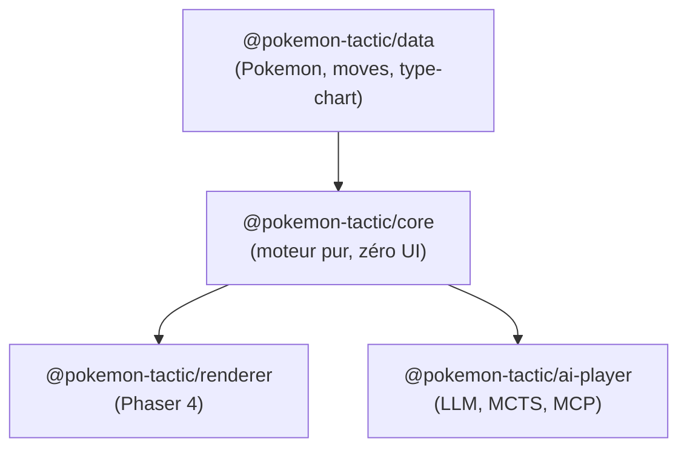
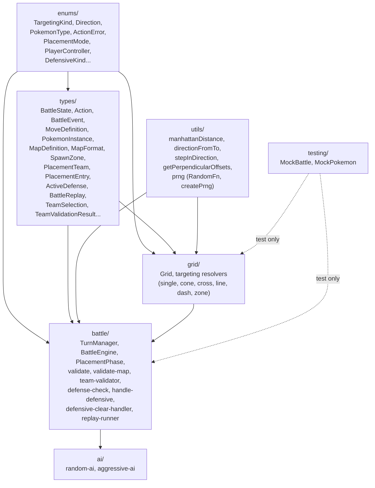
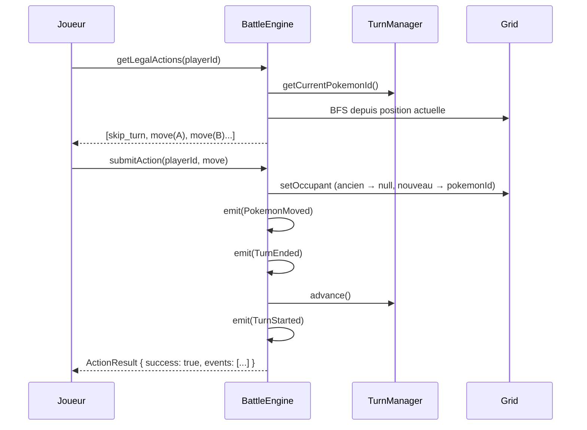
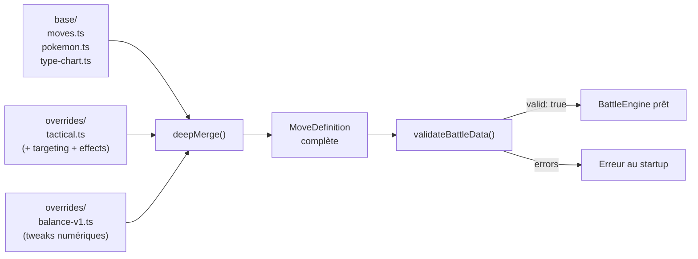

# Architecture technique — Pokemon Tactics

> Pour le game design, voir [game-design.md](game-design.md).
> Pour les décisions, voir [decisions.md](decisions.md).

---

## 1. Principe fondamental : moteur découplé du rendu

```
┌──────────────────────────────────────────────────┐
│                   @core                           │
│  (logique pure — ZERO dépendance UI/rendu)        │
│                                                   │
│  - État du combat (grille, Pokemon, tours)          │
│  - Calculs (dégâts, types, portée, AoE, LOS)     │
│  - Pathfinding, initiative                        │
│  - Validation des actions                         │
│  - Génération du log de combat (replay)           │
│                                                   │
│  API : recevoir des actions, retourner un état    │
└───────────┬──────────────┬───────────────┬────────┘
            │              │               │
 ┌──────────▼──┐   ┌──────▼──────┐  ┌─────▼─────────┐
 │  @renderer  │   │ @ai-player  │  │  Text / CLI   │
 │  (Phaser)   │   │ (LLM, MCTS, │  │  (debug,      │
 │             │   │  MCP server) │  │   replay,     │
 │             │   │              │  │   tests)      │
 └─────────────┘   └─────────────┘  └───────────────┘
```

**Avantages :**
- Changer de renderer sans toucher à la logique (Phaser → Three.js → Godot)
- Faire jouer des IA sans interface graphique
- Tests unitaires sur la logique pure
- Mode headless : 1000 combats en quelques secondes (équilibrage)
- Replays rejouables dans n'importe quel renderer

### Diagramme des packages



---

## 2. Stack

| | |
|---|---|
| Langage | TypeScript (strict mode) |
| Runtime | Node.js (dev/tests/AI) + Navigateur (jeu) |
| Bundler | Vite |
| Renderer | Phaser 4 (→ Three.js possible plus tard pour HD-2D avancé) |
| Tests | Vitest (core) + Playwright (rendu) |
| Linter/Formatter | Biome (remplace ESLint + Prettier + Stylelint) |
| Package manager | pnpm |
| Monorepo | pnpm workspaces |
| Versionning | Git + conventional commits |

---

## 3. Structure monorepo

```
pokemon-tactics/
├── packages/
│   ├── core/                    # Moteur de jeu pur (ZERO dépendance UI)
│   │   ├── src/
│   │   │   ├── enums/           # Const object enums (PokemonType, Direction, TargetingKind...)
│   │   │   ├── types/           # Interfaces (1 fichier = 1 type)
│   │   │   ├── utils/           # Fonctions pures (math, direction, géométrie)
│   │   │   ├── grid/            # Grid, Pathfinding, Targeting resolvers
│   │   │   ├── battle/          # BattleEngine, TurnManager, effect handlers, turn pipeline
│   │   │   ├── testing/         # Mocks centralisés (MockPokemon...)
│   │   │   └── index.ts         # Barrel export (API publique)
│   │   ├── tsconfig.json        # extends ../../tsconfig.base.json
│   │   └── package.json
│   │
│   ├── renderer/                # Interface graphique (Phaser 4)
│   │   ├── src/
│   │   │   ├── scenes/          # Scènes Phaser : MainMenuScene → BattleModeScene → TeamSelectScene → BattleScene + BattleUIScene overlay ; SettingsScene, CreditsScene
│   │   │   ├── game/            # Orchestration (GameController, BattleSetup, AnimationQueue, DummyAiController)
│   │   │   ├── grid/            # Rendu isométrique (IsometricGrid : highlightGraphics, enemyRangeGraphics layer dédié, curseur animé)
│   │   │   ├── sprites/         # Sprites Pokemon (PokemonSprite, SpriteLoader, barres PV)
│   │   │   ├── i18n/            # Système i18n maison : types.ts, locales/fr.ts, locales/en.ts, index.ts (t, setLanguage, detectLanguage, onLanguageChange, Language enum)
│   │   │   ├── settings/        # Paramètres persistants : GameSettings { damagePreview }, getSettings(), updateSettings(), localStorage("pt-settings")
│   │   ├── ui/              # Interface FFT-like (ActionMenu, InfoPanel, TurnTimeline, BattleUI, DirectionPicker, PlacementRosterPanel, MoveTooltip, pattern-preview, SandboxPanel, LanguageToggle, TeamSelectPanel — panel Joueur + panel Dummy + toolbar, BattleLogPanel, BattleLogFormatter)
│   │   │   ├── utils/           # Utilitaires renderer (screen-direction : getDirectionFromScreenPosition)
│   │   │   ├── enums/           # Enums renderer (HighlightKind — dont EnemyRange)
│   │   │   ├── types/           # Types renderer (BattleConfig : confirmAttack)
│   │   │   ├── constants.ts     # Depth centralisé, couleurs équipe, tailles UI, POKEMON_SPRITE_SCALE, TILE_SPRITE_SCALE, TERRAIN_TEXTURE_MAP, POKEMON_SPRITE_GROUND_OFFSET_Y, DEPTH_GRID_PREVIEW, DEPTH_GRID_ENEMY_RANGE, TILE_PREVIEW_COLOR, TILE_HIGHLIGHT_ENEMY_RANGE_COLOR, STATUS_ICON_KEY, HP_COLOR_MEDIUM, STAT_BADGE_BUFF_COLOR, STAT_BADGE_DEBUFF_COLOR, BattleLogColors, couleurs tooltip/buttons/text centralisées
│   │   │   └── main.ts
│   │   ├── public/
│   │   │   └── assets/
│   │   │       ├── sprites/pokemon/{name}/  # atlas.json, atlas.png, portrait-normal.png, credits.txt, offsets.json (générés)
│   │   │       ├── tilesets/               # Tiles isométriques : ICON Isometric Pack (Jao), 32×32px, filtre NEAREST, scale ×2
│   │   │       └── ui/
│   │   │           ├── arrows.png           # Spritesheet flèches DirectionPicker
│   │   │           ├── types/               # Type icons Pokepedia ZA (Légendes Pokémon Z-A) : {type}.png, 36x36px sans texte (18 types)
│   │   │           ├── categories/          # Category icons Bulbagarden SV : physical.png, special.png, status.png — 50x40px
│   │   │           └── statuses/            # Status icons Pokepedia ZA : icon-{status}.png (52x36), label-{status}.png (172x36) — 7 statuts majeurs
│   │   ├── index.html
│   │   ├── vite.config.ts
│   │   ├── tsconfig.json        # extends base + DOM libs
│   │   └── package.json
│   │
│   └── data/                    # Données Pokemon (partagées)
│       ├── src/
│       │   ├── base/            # Données officielles (Showdown/PokeAPI) — inclut Pokemon "Dummy" (Normal, stats 100/50x5, movepool défensif)
│       │   ├── overrides/       # Surcharges tactiques + balance
│       │   ├── i18n/            # Noms localisés : moves.fr.json, moves.en.json, pokemon-names.fr.json, pokemon-names.en.json
│       │   └── index.ts         # Exporte getMoveName(id, lang) et getPokemonName(id, lang)
│       ├── tsconfig.json        # extends ../../tsconfig.base.json
│       └── package.json
│
├── scripts/                     # Outils de build one-shot (non packagés)
│   ├── extract-sprites.ts       # Pipeline PMDCollab : télécharge sprites → atlas Phaser (inclut Sleep depuis plan 018)
│   ├── download-status-icons.ts # Télécharge 14 assets statut ZA depuis Pokepedia (7 icônes 52x36 + 7 miniatures 172x36)
│   ├── generate-golden-replay.ts # Génère packages/core/fixtures/replays/golden-replay.json (3v3 aggressive vs aggressive, seed 12345)
│   └── sprite-config.json       # Config extensible (Pokemon, animations dont Sleep, portraits)
├── docs/
│   ├── images/                  # Screenshots pour le README
│   ├── plans/                   # Plans d'exécution numérotés (40 plans)
│   ├── architecture.md
│   ├── game-design.md
│   ├── decisions.md
│   ├── roadmap.md
│   ├── references.md
│   └── ...
├── .github/
│   └── ISSUE_TEMPLATE/          # Templates bug report, feature request, feedback
├── package.json                 # Workspace root (scripts, devDependencies)
├── pnpm-workspace.yaml
├── tsconfig.base.json           # Config TS partagée (strict, bundler, path aliases)
├── tsconfig.json                # Racine, extends base
├── biome.json                   # Lint + format (recommended + nursery)
├── vitest.config.ts             # Tests + coverage
├── CLAUDE.md
├── CREDITS.md                   # Attribution CC BY-NC 4.0 PMDCollab (artistes par Pokemon)
├── LICENSE                      # MIT (code) + note CC BY-NC 4.0 (sprites)
├── README.md
└── STATUS.md
```

### Organisation du core

Structure flat par responsabilité. On restructurera par domaine quand la complexité le justifiera (Phase 1-2).

| Dossier | Contenu | Tests |
|---------|---------|-------|
| `enums/` | Const object enums (pattern `as const` + type dérivé) — dont `PlacementMode`, `PlayerController`, `DefensiveKind`, `TeamValidationError` | Non testé (compilation = validation) |
| `types/` | Interfaces, 1 fichier = 1 type — dont `MapDefinition`, `MapFormat`, `SpawnZone`, `PlacementTeam`, `PlacementEntry`, `ActiveDefense`, `TeamSelection`, `TeamValidationResult` | Non testé (compilation = validation) |
| `utils/` | Fonctions pures réutilisables (math, direction, géométrie) | Oui |
| `grid/` | Classe Grid, targeting resolvers | Oui |
| `battle/` | BattleEngine, TurnManager, PlacementPhase, validate, validate-map, team-validator, defense-check, handle-defensive, defensive-clear-handler, replay-runner | Oui |
| `ai/` | IA scriptées headless : `random-ai.ts` (action légale aléatoire), `aggressive-ai.ts` (fonce + tape le plus puissant) | Oui |
| `testing/` | Mocks centralisés (`abstract class MockX`) — dont `MockTeamSelection` | Exclu du coverage et du build |

### Diagramme interne du core



### Configuration TypeScript

Un seul `tsconfig.base.json` à la racine avec `moduleResolution: "bundler"` et les path aliases. Chaque package hérite via `extends`. Pas de project references, pas de `composite`, pas de `dist/` intermédiaires. Pattern identique à un monorepo Nx/Angular.

---

## 4. Système d'attaques : composition Targeting + Effects

Chaque attaque est **déclarative** (données, pas du code custom). Définie par deux axes :
- **Targeting** : comment on cible (pattern spatial)
- **Effects** : ce qui arrive aux cibles (dégâts, statut, buff, lien...)

```typescript
interface MoveDefinition {
  id: string;
  type: PokemonType;
  category: 'physical' | 'special' | 'status';
  power: number;
  accuracy: number;
  pp: number;
  targeting: TargetingPattern;
  effects: Effect[];
}

// Patterns de ciblage — discriminated union, extensible
type TargetingPattern =
  | { kind: 'single'; range: { min: number; max: number } }
  | { kind: 'self' }
  | { kind: 'cone'; range: { min: number; max: number } }      // largeur = distance * 2 - 1 (pas de paramètre width)
  | { kind: 'cross'; size: number }                             // toujours centré sur le caster, pas de range
  | { kind: 'line'; length: number }
  | { kind: 'dash'; maxDistance: number }
  | { kind: 'zone'; radius: number }
  | { kind: 'slash' }                                           // arc frontal 3 cases, pas de paramètre
  | { kind: 'blast'; range: { min: number; max: number }; radius: number }

// Effets — composables, une attaque peut en avoir plusieurs
type Effect =
  | { kind: 'damage'; hits?: number | { min: number; max: number } }  // hits = multi-hit (fixe ou variable)
  | { kind: 'status'; status: StatusType; chance: number }
  | { kind: 'stat_change'; stat: Stat; stages: number; target: 'self' | 'targets' }
  | { kind: 'volatile_status'; status: 'seeded' | 'trapped'; duration?: number }
                                                          // Seeded = Vampigraine (drain + heal source), Trapped = Piège (immobilise + DoT)
  | { kind: 'knockback' }                                 // pousse 1 case dans la direction opposée au lanceur
```

// Sur PokemonInstance :
// - `status: StatusType | null`          — 1 statut majeur max (Burned, Poisoned, BadlyPoisoned, ...)
// - `volatileStatuses: VolatileStatus[]` — statuts volatils coexistants (Confused, Seeded, Trapped...)
// - `toxicCounter: number`               — compteur de tours pour BadlyPoisoned (0 = inactif)
// - `recharging: boolean`                — true si le Pokemon doit recharger (Hyper Beam)
// Note : le système `ActiveLink` (LeechSeed + Bind via LinkType) a été supprimé en plan 031.
//        Vampigraine → statut volatil `Seeded` (sourceId, drain 1/8 HP/tour, immunité Plante)
//        Piège (Wrap/Bind) → statut volatil `Trapped` (immobilise, 1/8 HP/tour, N tours)

**Exécution en 3 étapes :**
1. `resolveTargeting(move, caster, targetTile, grid)` → tiles affectées
2. `resolveEffects(move, caster, affectedTiles, state)` → précision, dégâts, statuts
3. `emit(events)` → liste d'événements

Chaque `kind` de targeting a un **resolver** (pure function). Chaque `kind` d'effect a un **processor**.
Ajouter une nouvelle mécanique = ajouter un `kind` dans l'union + son resolver/processor. Pas de refactor.

### Flux d'un tour de combat



---

## 5. Système d'événements : core → renderer

Le core est **synchrone** et émet des événements. Les consommateurs (renderer, replay, IA, CLI) les traitent comme ils veulent.

```typescript
type BattleEvent =
  | { type: 'turn_started'; pokemonId: string }
  | { type: 'move_started'; attackerId: string; moveId: string }
  | { type: 'pokemon_moved'; pokemonId: string; path: Position[] }
  | { type: 'pokemon_dashed'; pokemonId: string; path: Position[]; hitId?: string }
  | { type: 'damage_dealt'; targetId: string; amount: number; effectiveness: number }
  | { type: 'status_applied'; targetId: string; status: StatusType }
  | { type: 'stat_changed'; targetId: string; stat: Stat; stages: number }
  | { type: 'volatile_status_applied'; targetId: string; status: 'seeded' | 'trapped'; sourceId?: string }
  | { type: 'volatile_status_removed'; targetId: string; status: 'seeded' | 'trapped' }
  | { type: 'seeded_drained'; targetId: string; sourceId: string; amount: number }
  | { type: 'defense_activated'; pokemonId: string; kind: DefensiveKind }
  | { type: 'defense_triggered'; pokemonId: string; kind: DefensiveKind }
  | { type: 'defense_cleared'; pokemonId: string }
  | { type: 'pokemon_ko'; pokemonId: string; countdownStart: number }
  | { type: 'pokemon_eliminated'; pokemonId: string }
  | ...
```

**Le core n'attend jamais le renderer.** Un `submitAction()` est synchrone :
il mute l'état, émet les events, et retourne. L'IA peut donc jouer des milliers
de parties par seconde sans aucun overhead visuel.

**Le renderer gère sa propre queue d'animations.** Il reçoit les events,
les empile, et les joue séquentiellement avec des tweens/animations Phaser.
Le joueur humain attend la fin des animations avant d'agir.

```
Core (sync)          Renderer (async)         IA (sync)
    │                     │                      │
    ├── emit(events) ────►│ queue + animate       │
    │                     │   await tween...      │
    │                     │   await tween...      │
    │                     │   done → unlock UI    │
    │                     │                      │
    ├── emit(events) ◄───────────────────────────┤ submitAction() → instant
    │                     │                      │
```

Les mêmes events alimentent les **replays** (sérialisation JSON).

---

## 5b. Mode Sandbox

Accessible uniquement via `pnpm dev:sandbox` (variable d'environnement Vite `VITE_SANDBOX`). Lance un combat 1v1 sur micro-carte 6x6. Les query params URL ont été supprimés (plan 035).

### Lancement

```bash
pnpm dev:sandbox                        # Config par défaut (DEFAULT_SANDBOX_CONFIG)
pnpm dev:sandbox packages/data/sandbox-configs/config.json   # Depuis un fichier JSON
pnpm dev:sandbox '{"pokemon":"pikachu"}'       # JSON inline
```

### Architecture du mode sandbox

- **`SandboxConfig.ts`** : type `SandboxConfig` + constante `DEFAULT_SANDBOX_CONFIG` — config par défaut injectée si aucun argument CLI
- **`BattleSetup.createSandboxBattle(config)`** : crée la carte 6x6, place le joueur en bas et le Dummy en haut, sans phase de placement interactif
- **`DummyAiController`** : contrôleur IA minimal — soumet l'action du move assigné si légale, sinon `EndTurn`. Le dummy peut être passif ou utiliser un des 8 moves défensifs.
- **`SandboxPanel`** (HTML overlay) : 2 panneaux côte à côte (Joueur à gauche, Dummy à droite) + toolbar au-dessus
  - Panel Joueur : dropdown Pokemon, 2 dropdowns moves (filtrés par movepool + dédoublonnage), slider HP %, dropdown statut, stages de stats
  - Panel Dummy : dropdown "Stats de" (custom ou preset Pokemon), stats éditables, niveau, slider HP %, dropdown move défensif, dropdown direction
  - Toolbar : bouton Réinitialiser (recrée le combat), bouton **Exporter JSON** (copie la config courante en JSON dans le presse-papier)
- **Écran de victoire HTML** : overlay HTML au lieu de Phaser Graphics — contourne le bug de hitbox Phaser 4 avec camera zoom
- **`packages/data/sandbox-configs/`** : fichiers JSON d'exemple (configs prêtes à l'emploi)

> Le sprite du Dummy est le sprite PMDCollab `#0000 form 1` (sprite générique).

---

## 5c. Système i18n

Le renderer supporte FR et EN. Le core est i18n-free : il émet des events avec des IDs, le renderer traduit.

### Principe

- **Pas de lib externe** : ~70 lignes maison pour <300 clés et 2 langues — `i18next` serait surdimensionné
- **Core i18n-free** : le core manipule des IDs (`pokemon-id`, `move-id`). La traduction est au niveau du renderer
- **Noms Pokemon/moves dans `@pokemon-tactic/data`** : fichiers JSON localisés séparés du système de traduction UI — pas de dépendance cyclique

### Fichiers

```
packages/renderer/src/i18n/
  types.ts          # Language const enum ('fr' | 'en'), interface Translations (toutes les clés UI typées)
  index.ts          # t(key), setLanguage(lang), detectLanguage(), getLanguage(), onLanguageChange(callback)
                    # Persistance localStorage sous la clé 'pt-lang'
  locales/
    fr.ts           # Textes français
    en.ts           # Textes anglais

packages/data/src/i18n/
  moves.fr.json          # move-id → nom FR
  moves.en.json          # move-id → nom EN
  pokemon-names.fr.json  # pokemon-id → nom FR
  pokemon-names.en.json  # pokemon-id → nom EN
```

### Comportements

- **Détection auto** : `detectLanguage()` lit `navigator.language` → 'fr' si commence par 'fr', sinon 'en'
- **Persistance** : `setLanguage()` écrit en localStorage ; relecture au démarrage
- **Changement de langue** : restart de scène Phaser (rebuild complet des UI) — pas de hot-swap des Text Phaser individuels
- **`Language` type dans le renderer uniquement** : `@pokemon-tactic/data` accepte `string` pour éviter une dépendance cyclique

### Composant LanguageToggle

`packages/renderer/src/ui/LanguageToggle.ts` — bouton bascule FR/EN (coin haut gauche), appelle `setLanguage()` puis `scene.restart()`.

### Composant BattleLogPanel (plan 037)

`packages/renderer/src/ui/BattleLogPanel.ts` — panel de log de combat affiché en haut à droite de `BattleUIScene`.

- Alimenté par les `BattleEvent` existants (TurnStarted, MoveStarted, DamageDealt, MoveMissed, StatusApplied/Removed, StatChanged, PokemonKo, DefenseActivated/Triggered, ConfusionTriggered, KnockbackApplied, MultiHitComplete, RechargeStarted, BattleEnded)
- Couleurs par type de message (dégâts rouge, stat up bleu, stat down rouge, statut orange, défense vert, KO rouge vif, effectiveness jaune)
- Noms de Pokemon cliquables → `camera.pan()` vers le Pokemon ciblé
- Pliable/dépliable via header toggle (icône ☰ en état replié)
- Scroll interne (molette) avec auto-scroll bas à chaque nouveau message
- Barre d'actions replay grisée réservée (⏮ ⏪ ▶ ⏩ ⏭)

`packages/renderer/src/ui/BattleLogFormatter.ts` — traduit chaque `BattleEvent` en message texte i18n. Logique pure, sans dépendance Phaser. Couvert par 41 tests unitaires.

---

## 6. Système de surcharge (override) pour l'équilibrage

### Structure des données

```
packages/data/
  base/                    # Données Pokemon officielles (importables de Showdown)
    moves.ts               # power, accuracy, pp, type, category...
    pokemon.ts             # stats, types, poids, movepool...
    type-chart.ts          # 18x18 efficacités

  overrides/
    tactical.ts            # Ajoute targeting + effects (n'existe pas dans Pokemon)
    balance-v1.ts          # Ajustements numériques (PP, chances, portées...)

  maps/                    # Définitions de cartes (MapDefinition)
    poc-arena.ts           # Carte POC 12x12, format 2 joueurs (plan 013)
```

### Merge par couches

```
Données finales = deepMerge(base, tactical, balance)
```

- **base** : données Pokemon pures (power, accuracy, pp, type...)
- **tactical** : ajoute targeting + effects (la couche "grille tactique")
- **balance** : tweaks numériques par-dessus

Les overrides sont **optionnels et additifs**. Changer de balance = changer un fichier.
Permet de proposer des rulesets/métas différents plus tard.

### Pipeline de données



### Validation au startup

Un validateur vérifie au démarrage que chaque entité finale est complète et cohérente :
- Chaque move a un targeting et au moins un effect
- Chaque pokemon référence des moves qui existent
- Les ids sont uniques, pas de référence cassée
- Erreur explicite si une override casse la structure

Léger en coût (ne tourne qu'une fois au boot), gros gain en confiance sur les données.

---

## 7. Pipeline sprites PMDCollab

Les sprites sont extraits depuis [PMDCollab/SpriteCollab](https://github.com/PMDCollab/SpriteCollab) par un script one-shot (`scripts/extract-sprites.ts`), non packagé dans le jeu.

```
PMDCollab GitHub (raw)
  └── AnimData.xml + {Anim}-Anim.png + Idle-Offsets.png + PortraitSheet.png + credits.txt
        │  (téléchargement + parse fast-xml-parser)
        ▼
scripts/extract-sprites.ts  ←  scripts/sprite-config.json
        │  (découpe frames via sharp, génère atlas, parse pixels offsets)
        ▼
packages/renderer/public/assets/sprites/pokemon/{name}/
  ├── atlas.json          # Phaser atlas descriptor (frames + metadata)
  ├── atlas.png           # Spritesheet combiné (toutes anims + directions)
  ├── portrait-normal.png # Portrait 40x40 (émotion Normal)
  ├── offsets.json        # Offsets par Pokemon : shadowOffsetY, bodyOffset, headOffset (générés)
  └── credits.txt         # Attribution artiste (CC BY-NC 4.0)
```

**Clés d'animation Phaser** : `{pokemonId}-{anim}-{direction}` (ex : `bulbasaur-idle-south`)

**SpriteLoader** (`packages/renderer/src/sprites/SpriteLoader.ts`) :
- `preloadPokemonAssets(scene, pokemonIds[])` — charge atlas + portrait + `offsets.json` au preload
- `createAnimations(scene, pokemonId)` — enregistre les animations Phaser depuis les metadata d'atlas
- `getSpriteOffsets(scene, definitionId)` — retourne `SpriteOffsets` depuis le cache JSON, avec fallback sur valeurs par défaut si absent

**PokemonSprite** utilise les animations (Idle, Walk, Attack, Hurt, Faint) avec fallback sur cercle coloré si atlas absent.

---

## 8. API du core

Le core expose une interface simple que tout joueur (humain ou IA) utilise :

```typescript
interface BattleEngine {
  // État visible pour le joueur actif
  getGameState(playerId: string): GameState;

  // Actions légales (l'IA itère là-dessus)
  getLegalActions(playerId: string): Action[];

  // Soumettre une action — synchrone, retourne le résultat + events
  submitAction(playerId: string, action: Action): ActionResult;

  // Souscrire aux événements (renderer, replay, debug)
  on(event: string, handler: (e: BattleEvent) => void): void;
}
```

---

## 9. Système de replay

```typescript
interface BattleReplay {
  seed: number;      // seed du PRNG mulberry32 (0 si Math.random utilisé)
  actions: Action[]; // chaque action jouée dans l'ordre (enregistrée par submitAction)
}
```

Le replay est **déterministe** : même seed + mêmes actions = même résultat.

### PRNG mulberry32

`packages/core/src/utils/prng.ts` expose :
- `type RandomFn = () => number` — même signature que `Math.random`
- `createPrng(seed: number): RandomFn` — constructeur du PRNG

Le `BattleEngine` accepte un `random?: RandomFn` en dernier paramètre du constructeur (défaut : `Math.random`). La fonction est propagée via `EffectContext` à tous les handlers qui ont besoin d'aléatoire (`accuracy-check`, `damage-calculator`, `handle-status`, `handle-damage`, `status-tick-handler`). Zéro `Math.random()` direct dans `packages/core/src/battle/`.

### Enregistrement et rejeu

- `BattleEngine.exportReplay()` retourne `{ seed, actions: [...recordedActions] }`
- `runReplay(replay, buildEngine)` dans `replay-runner.ts` recrée un engine avec le seed et soumet les actions dans l'ordre
- `packages/core/fixtures/replays/golden-replay.json` : replay de référence (3v3 aggressive vs aggressive, seed 12345, Player 1 gagne en 32 rounds / 247 actions)
- `golden-replay.test.ts` : test de non-régression — si une mécanique aléatoire change, le test pète → relancer `pnpm replay:generate`

---

## 10. Outillage Claude Code

| Besoin | Solution |
|--------|----------|
| Écrire du code | Claude Code + TypeScript (natif) |
| Lancer le jeu | `pnpm dev` → Vite dev server |
| Voir le rendu | MCP Playwright — screenshots, interaction |
| Tests | `pnpm test` (Vitest) |
| Faire jouer une IA | Script Node.js important le core |
| Voir un replay | Charger le JSON dans le renderer web |

---

## 11. Évolutions prévues du renderer

| Phase | Renderer | Style |
|-------|----------|-------|
| POC | Phaser 4 (2D isométrique) | Sprites + tiles isométriques |
| HD-2D | **Babylon.js** ou Three.js (spike comparatif prévu) | Terrain 3D + sprites 2D billboardés + DoF/bloom |
| Optionnel | Godot (desktop) | HD-2D natif, rendu Vulkan |

Babylon.js = built-in post-processing (DoF, bloom, tilt-shift), écrit en TypeScript, `NullEngine` pour tests headless.
Three.js = plus léger, plus grande communauté. Spike comparatif quand on atteindra la phase HD-2D.

Le core ne change jamais — seul le renderer est remplacé.

---

## 12. Agents & Skills Claude Code

Agents custom dans `.claude/agents/` et skills dans `.claude/skills/` pour automatiser le workflow.

### Agents actifs

| Agent | Modèle | Rôle |
|-------|--------|------|
| `core-guardian` | haiku | Vérifie que core n'a aucune dépendance UI |
| `doc-keeper` | sonnet | Maintient la documentation à jour (checklist systématique sur tous les fichiers doc) |
| `code-reviewer` | sonnet | Review qualité, TS strict, conventions |
| `commit-message` | sonnet | Propose un message de commit basé sur le contexte (plan, phase, session) puis valide via `git diff` |
| `game-designer` | sonnet | Cohérence et équilibre des mécaniques |
| `visual-analyst` | sonnet | Analyse visuels + web search pour inspiration |
| `session-closer` | sonnet | Met à jour STATUS.md en fin de session, chaîne vers `commit-message` si changements non commités |
| `test-writer` | sonnet | Tests Vitest, approche test-first |
| `data-miner` | sonnet | Import données Pokemon (Showdown/PokeAPI) |
| `dependency-manager` | sonnet | Gestion des dépendances npm — vérifie aussi les deprecation warnings |
| `best-practices` | sonnet | Recherche de bonnes pratiques du marché |
| `asset-manager` | sonnet | Gestion des assets (sprites, tilesets, sons) |
| `plan-reviewer` | sonnet | Crée, review et maintient les plans |
| `performance-profiler` | sonnet | Analyse performances (FPS, mémoire, bundle) |
| `debugger` | opus | Diagnostic de bugs complexes |
| `visual-tester` | sonnet | Vérification visuelle via Playwright MCP (screenshots, console, interactions) |
| `ci-setup` | sonnet | Configuration GitHub Actions |
| `agent-manager` | sonnet | Audite et maintient les agents/skills (format, cohérence, qualité) |
| `sandbox-json` | sonnet | Génère des configs sandbox JSON à partir de descriptions en langage naturel |

### Comportements notables

- **`code-reviewer`** : review qualité, TypeScript strict, conventions. Escalade vers l'humain si diff > 15 fichiers ou pattern intentionnel détecté. Ne propose plus de message de commit (délégué à `commit-message`).
- **`commit-message`** : part du contexte (numéro de plan, phase, description de session) pour proposer un titre, puis confirme avec `git diff`. Appelé par `session-closer` en fin de session si des changements ne sont pas encore commités.
- **`sandbox-json`** : traduit une description en langage naturel ("Bulbizarre brûlé face à un Dummy Protect") en config JSON sandbox complète. Connaît tous les champs de `SandboxConfig` et leurs valeurs valides. Génère un JSON prêt à copier-coller ou à passer en argument à `pnpm dev:sandbox`.
- **`doc-keeper`** : checklist systématique — parcourt tous les fichiers de la table, vérifie la cohérence des termes entre les docs, maintient la section "Sources et crédits" du README.
- **`dependency-manager`** : en plus de l'audit standard, détecte les plugins remplacés par des fonctionnalités natives du tool (ex: plugin Vite remplacé par une option built-in) en lançant `pnpm build 2>&1` et `pnpm test 2>&1`.

### Chaînes d'agents documentées

| Déclencheur | Chaîne |
|-------------|--------|
| Étape intermédiaire d'un plan (core touché) | `core-guardian` + `test-writer` |
| Étape intermédiaire d'un plan (renderer touché) | rien (seulement en fin de plan) |
| Fin de plan | `code-reviewer` + `doc-keeper` (+ `core-guardian` si core touché, + `visual-tester` si renderer touché) |
| Bugfix / refacto / expérimentation hors plan | `code-reviewer` + `doc-keeper` |
| Modif mécaniques de jeu | `game-designer` |
| `code-reviewer` déclenche | `core-guardian` (si core), `game-designer` (si mécaniques), `visual-tester` (si renderer) |
| `visual-tester` déclenche | `sandbox-json` (si génération de config sandbox nécessaire) |
| `debugger` déclenche | `visual-tester` (si composante visuelle) |
| Ajout/modif données Pokemon | `data-miner` + `game-designer` |
| Fin de session | vérification `pnpm build` + `pnpm test` → `session-closer` → `doc-keeper` + `commit-message` (si non commité) |
| Ajout de dépendance | `dependency-manager` |
| Nouveau plan ou plan à réviser | `plan-reviewer` |
| Bug visuel ou modif renderer isolée | `visual-tester` |

### Agents placeholder (à activer plus tard)

| Agent | Rôle | Phase |
|-------|------|-------|
| `ai-player` | Playtester automatisé via API core | Phase 1 |
| `balancer` | Analyse winrates, propose des overrides | Phase 2-3 |
| `level-designer` | Crée et valide des maps JSON | Phase 1-2 |

### Skills

| Commande | Action |
|----------|--------|
| `/next` | Lit STATUS.md + roadmap, propose la suite |
| `/review` | Lance code-reviewer sur les changements |
| `/status` | Met à jour STATUS.md (fin de session) |
| `/inspire <jeu>` | Analyse visuelle pour inspiration |
| `/plan <titre>` | Crée ou review un plan d'exécution |
| `/debug <bug>` | Diagnostic avancé (agent debugger, opus) |
| `/practices <sujet>` | Recherche bonnes pratiques du marché |
