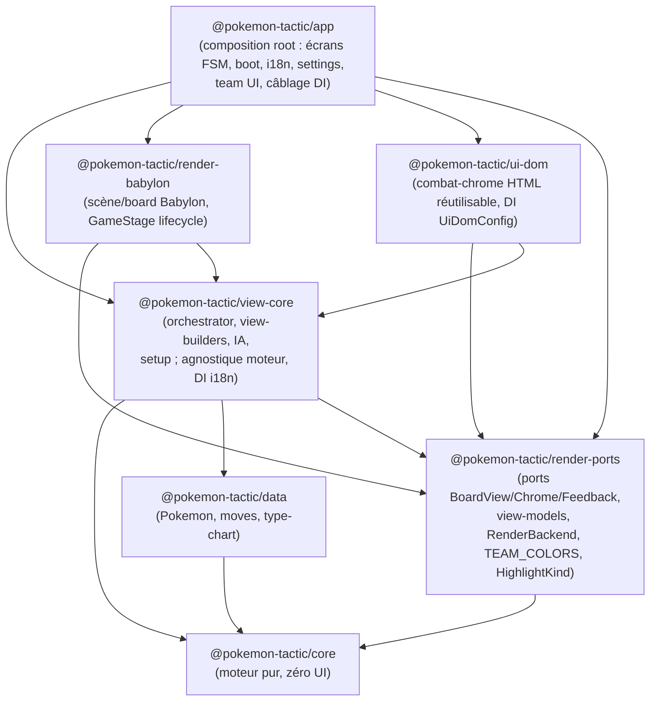
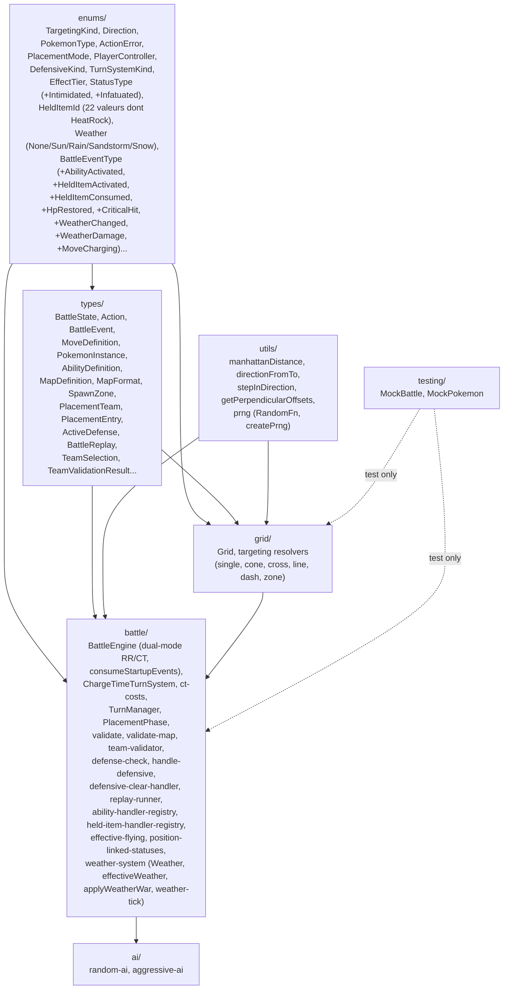
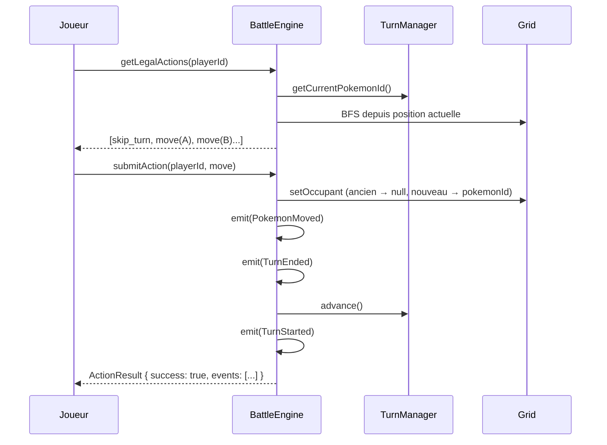
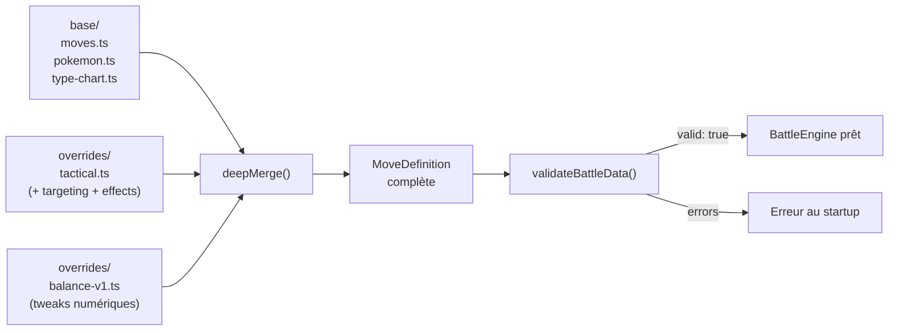

# Architecture technique — Pokemon Tactics

> Game design : [game-design.md](game-design.md). Décisions : [decisions.md](decisions.md).

---

## 1. Principe fondamental : moteur découplé du rendu

```
┌──────────────────────────────────────────────────┐
│                   @core                           │
│  (logique pure — ZERO dépendance UI/rendu)        │
│                                                   │
│  - État du combat (grille, Pokemon, tours)          │
│  - Calculs (dégâts, types, portée, AoE, LOS)     │
│  - Pathfinding, initiative                        │
│  - Validation des actions                         │
│  - Génération du log de combat (replay)           │
│                                                   │
│  API : recevoir des actions, retourner un état    │
└───────────┬──────────────┬───────────────┬────────┘
            │              │               │
 ┌──────────▼──┐   ┌──────▼──────┐  ┌─────▼─────────┐
 │  @renderer  │   │ @ai-player  │  │  Text / CLI   │
 │  (Phaser)   │   │ (LLM, MCTS, │  │  (debug,      │
 │             │   │  MCP server) │  │   replay,     │
 │             │   │              │  │   tests)      │
 └─────────────┘   └─────────────┘  └───────────────┘
```

**Avantages :**
- Changer renderer sans toucher logique (Phaser → Babylon.js → Godot)
- Faire jouer des IA sans UI
- Tests unitaires sur logique pure
- Mode headless : 1000 combats en secondes (équilibrage)
- Replays rejouables dans n'importe quel renderer

### Diagramme des packages

Découpage en packages (plan 125, noms finalisés plan 126) pour rendre un changement de moteur de rendu **mécanique** : un nouveau backend implémente les ports + réutilise `view-core` et `ui-dom`. Sens des flèches = « dépend de ».

### Schéma de nommage des packages

| Préfixe | Signification | Exemples |
|---------|---------------|---------|
| _(aucun)_ | Domaine pur, zéro UI/DOM | `core`, `data` |
| `view-` | Logique de vue engine-agnostic, headless (jamais DOM direct) | `view-core` |
| `render-` | Besoin d'un moteur de rendu ou du DOM navigateur | `render-babylon`, `render-canvas2d`, `render-ports` |
| `ui-` | Widgets DOM purs (HTML/CSS, pas de moteur 3D) | `ui-dom` |
| `app` (racine) | Composition root / entry-point Vite | `app` |

> **`render-ports`** est le cas particulier : ports hexagonaux du contrat de rendu (interfaces uniquement, DOM-free, dépend de `core` uniquement). Le préfixe `render-` signale qu'il appartient à la frontière rendu.

> **Pourquoi `view-core` et pas `presentation` ?** Le terme "presentation" est un faux-ami (évoque la couche UI/écrans dans les architectures MVC/MVP). Ce package contient la logique de vue headless (orchestrateur, builders, IA, setup) — agnostique du moteur, sans DOM. `view-core` lève l'ambiguïté.

### Architecture : Hexagonal / Ports & Adapters + Humble Object + Dependency Inversion

Le découpage suit le pattern Hexagonal (Ports & Adapters) :
- **`render-ports`** définit les interfaces (ports) que tout backend de rendu doit implémenter (`BoardView`, `BattleChrome`, `BattleFeedback`, `RenderBackend`). `BoardView.onTileClick` porte un `TilePointerSource` (`"pointer" | "touch"`, plan 183) : le renderer transmet seulement la **source** du press, jamais une décision — l'arbitrage tactile (viser un pattern directionnel par direction, pas par case) reste dans `view-core`/l'orchestrateur, seul à connaître la direction.
- **`render-babylon`** et **`render-canvas2d`** sont des adapters (implémentations concrètes des ports).
- **`view-core`** orchestre en dépendant uniquement des ports, jamais des adapters.
- **Humble Object** : `app` est le seul point à connaître les dépendances concrètes (câblage DI au boot).
- **Dependency Inversion** : les packages de haut niveau (`view-core`) ne dépendent pas des détails (`render-babylon`), les deux dépendent d'abstractions (`render-ports`).
- **Exemple concret (plan 183)** : la boussole Babylon doit se caler sur une case du chrome DOM, mesurée par `createChromeInsetProbe` (`packages/ui-dom/src/chrome-insets.ts`). Plutôt que `render-babylon` importe `ui-dom`, `app` mesure et passe un callback `timelineFirstCell` dans `CombatSceneOptions` — le renderer ne reçoit que des nombres, jamais une dépendance DOM.


```mermaid
graph TD
    core["@pokemon-tactic/core<br/>(moteur pur, zéro UI)"]
    data["@pokemon-tactic/data<br/>(Pokemon, moves, type-chart)"]
    renderPorts["@pokemon-tactic/render-ports<br/>(ports BoardView/Chrome/Feedback,<br/>view-models, RenderBackend, TEAM_COLORS, HighlightKind)"]
    viewCore["@pokemon-tactic/view-core<br/>(orchestrator, view-builders, IA,<br/>setup ; agnostique moteur, DI i18n)"]
    renderBabylon["@pokemon-tactic/render-babylon<br/>(scène/board Babylon, GameStage lifecycle)"]
    uiDom["@pokemon-tactic/ui-dom<br/>(combat-chrome HTML réutilisable, DI UiDomConfig)"]
    app["@pokemon-tactic/app<br/>(composition root : écrans FSM, boot, i18n, settings,<br/>team UI, câblage DI)"]

    data --> core
    renderPorts --> core
    viewCore --> core
    viewCore --> data
    viewCore --> renderPorts
    renderBabylon --> renderPorts
    renderBabylon --> viewCore
    uiDom --> renderPorts
    uiDom --> viewCore
    app --> viewCore
    app --> renderBabylon
    app --> uiDom
    app --> renderPorts
```

---

## 2. Stack

| | |
|---|---|
| Langage | TypeScript (strict mode) |
| Runtime | Node.js (dev/tests/AI) + Navigateur (jeu) |
| Bundler | Vite |
| Renderer | Babylon.js (backend `render-babylon` derrière le contrat ; un second moteur = nouveau package implémentant le contrat) |
| Tests | Vitest (core) + Playwright (rendu) |
| Linter/Formatter | Biome (remplace ESLint + Prettier + Stylelint) |
| Package manager | pnpm |
| Monorepo | pnpm workspaces |
| Versionning | Git + conventional commits |

---

## 3. Structure monorepo

```
pokemon-tactics/
├── packages/
│   ├── core/                    # Moteur de jeu pur (ZERO dépendance UI)
│   │   ├── src/
│   │   │   ├── enums/           # Const object enums (PokemonType, Direction, TargetingKind...)
│   │   │   ├── types/           # Interfaces (1 fichier = 1 type)
│   │   │   ├── utils/           # Fonctions pures (math, direction, géométrie)
│   │   │   ├── grid/            # Grid, Pathfinding, Targeting resolvers
│   │   │   ├── battle/          # BattleEngine, TurnManager, effect handlers, turn pipeline
│   │   │   ├── testing/         # Mocks centralisés (MockPokemon...)
│   │   │   └── index.ts         # Barrel export (API publique)
│   │   ├── tsconfig.json        # extends ../../tsconfig.base.json
│   │   └── package.json
│   │
│   ├── render-ports/            # Ports hexagonaux du contrat de rendu (plan 125, renommé plan 126)
│   │   ├── src/
│   │   │   ├── ports/           # BoardView, BattleChrome, BattleFeedback (interfaces moteur-agnostiques)
│   │   │   ├── view-models/     # WeatherView, TimelineView, InfoPanelData (+ preview/attack, plan 175), TileInfoData (plan 177)… (données UI découplées du core)
│   │   │   ├── presentation-context.ts  # PresentationContext (DI i18n + assets)
│   │   │   ├── render-backend.ts        # RenderBackend (lifecycle : mount/dispose)
│   │   │   ├── team-colors.ts           # TEAM_COLORS, teamColorByIndex, teamColorToHex, getTeamColorByPlayerId
│   │   │   ├── highlight-kind.ts        # HighlightKind enum
│   │   │   └── index.ts
│   │   ├── tsconfig.json        # dépend de core uniquement
│   │   └── package.json
│   │
│   ├── view-core/               # Logique de vue engine-agnostic headless (plan 125, renommé plan 126)
│   │   ├── src/
│   │   │   ├── battle-orchestrator/     # battle-orchestrator (FSM 9 phases combat)
│   │   │   ├── battle-views/            # view-builders (WeatherView, TimelineView, InfoPanelData…)
│   │   │   ├── combat-preview-view.ts   # buildCombatPreviewView (plan 175)
│   │   │   ├── floating-text-content.ts # contenu textes flottants
│   │   │   ├── movement-animation.ts    # logique animation déplacement
│   │   │   ├── animation-queue.ts       # AnimationQueue
│   │   │   ├── battle-setup.ts          # BattleSetup
│   │   │   ├── sandbox-setup.ts         # SandboxSetup
│   │   │   ├── ai/                      # AiTeamController, DummyAiController
│   │   │   ├── sandbox-config.ts        # SandboxConfig + DEFAULT_SANDBOX_CONFIG
│   │   │   └── constants.ts             # couleurs Champs, symboles aura/charge, durées tween, cluster BATTLE_TEXT
│   │   ├── tsconfig.json        # lib ["ES2022","WebWorker"] (timers sans DOM) ; dépend core/data/render-ports
│   │   └── package.json
│   │
│   ├── render-babylon/          # Backend de rendu Babylon.js (plan 125)
│   │   ├── src/
│   │   │   ├── babylon-*/       # babylon-picking, babylon-tile-highlights, babylon-decorations,
│   │   │   │                    # babylon-field-terrains, babylon-hover-cursor, babylon-sprite-hud,
│   │   │   │                    # babylon-direction-picker, babylon-aura-rings, babylon-color…
│   │   │   ├── battle-board-view.ts     # implémente BoardView (port render-ports)
│   │   │   ├── combat-scene.ts          # scène combat Babylon (délègue la caméra à IsometricCamera)
│   │   │   ├── isometric-camera.ts      # IsometricCamera : caméra dimetric (rotation snaps, zoom, pan)
│   │   │   ├── game-stage.ts            # implémente RenderBackend (lifecycle mount/dispose)
│   │   │   ├── load-tiled-map.ts        # chargement carte Tiled → scène Babylon
│   │   │   ├── map-preview-stage.ts     # preview carte
│   │   │   ├── sprite-depth-plugin.ts   # SpriteDepthPlugin (occlusion native depth-buffer)
│   │   │   ├── terrain-extruder.ts      # extrusion 3D du terrain depuis MapDefinition
│   │   │   ├── world-facing.ts          # orientation billboards
│   │   │   ├── world-projection.ts      # projection coordonnées monde → CSS viewport
│   │   │   ├── directional-billboard.ts # sprites PMDCollab directionnels + états
│   │   │   ├── floating-text-spawner.ts # textes flottants en moteur
│   │   │   ├── shaders/                 # plugins de matériau Babylon (MaterialPluginBase) —
│   │   │   │                            # decoration-wind-plugin.ts (vent voxel décorations),
│   │   │   │                            # liquid-shimmer-plugin.ts (anim procédurale surfaces
│   │   │   │                            # liquides : lueur/scintillement/ondulation, 2026-07-23),
│   │   │   │                            # water-foam-material.ts (écume de flottaison)
│   │   │   └── constants.ts             # constantes visuelles Babylon (BABYLON_*)
│   │   ├── tsconfig.json        # dépend core/data/view-core/render-ports + Babylon.js
│   │   └── package.json
│   │
│   ├── ui-dom/                  # Chrome HTML réutilisable (plan 125)
│   │   ├── src/
│   │   │   ├── battle-chrome.ts         # chrome combat complet (câble tous les panneaux)
│   │   │   ├── battle-log.ts            # BattleLogPanel + BattleLogFormatter
│   │   │   ├── move-tooltip.ts          # MoveTooltip
│   │   │   ├── placement-roster.ts      # bandeau placement (portraits, compteur, Terminer)
│   │   │   ├── turn-timeline.ts         # TurnTimeline (RR + CT)
│   │   │   ├── weather-hud.ts           # WeatherHud
│   │   │   ├── info-panel.ts            # InfoPanel
│   │   │   ├── tile-info-panel.ts       # TileInfoPanel (plan 177 — terrain/hazards/champ/zones de la case survolée)
│   │   │   │                           # info-panel.ts sert aussi de "cursor card" cible (plan 175, 2 instances)
│   │   │   ├── pattern-preview.ts       # previews de ciblage
│   │   │   ├── Modal.ts                  # primitive modale (<dialog>, closeAriaLabel DI)
│   │   │   ├── Stepper.ts                # primitive stepper (pure)
│   │   │   ├── form-controls.ts          # primitives boutons/selects/checkbox (pures)
│   │   │   ├── config.ts                # UiDomConfig (DI translate/getLanguage/getTypeIconUrl/getPortraitUrl/getItemIconUrl…)
│   │   │   ├── chrome-insets.ts         # createChromeInsetProbe (plan 183) : mesure la 1ère case de la timeline (taille/ancrage boussole)
│   │   │   ├── constants.ts             # BATTLE_LOG_COLOR_*
│   │   │   └── styles/                  # CSS co-localisé des composants (combat-chrome, modal, info-panel) + index.css
│   │   ├── tsconfig.json        # dépend core/data/view-core/render-ports
│   │   └── package.json
│   │
│   ├── app/                     # Composition root / app-shell Vite (plan 125, renommé plan 126)
│   │   ├── src/
│   │   │   ├── app/             # ScreenManager FSM + écrans DOM (main-menu, battle-mode, team-select,
│   │   │   │                    # my-teams, team-edit, settings, controls, credits, combat-screen,
│   │   │   │                    # map-select)
│   │   │   ├── babylon/         # Écrans qui câblent les backends : combat-screen (boucle combat),
│   │   │   │                    # placement-flow
│   │   │   ├── input/           # Couche d'entrée device-agnostique (plans 184/186) : actions logiques,
│   │   │   │                    # routeur par contexte, sources clavier/manette/pointeur, magasin de
│   │   │   │                    # bindings, navigation du focus DOM, étiquettes de touches
│   │   │   ├── i18n/            # Système i18n maison (t, setLanguage, detectLanguage, Language enum)
│   │   │   │   └── locales/     # fr.ts, en.ts
│   │   │   ├── settings/        # Paramètres persistants : GameSettings, getSettings(), updateSettings()
│   │   │   ├── styles/          # CSS global + tokens.css (vars primitives/sémantiques)
│   │   │   ├── ui/
│   │   │   │   ├── dom/         # Modal, Stepper, MovesList, form-controls, SandboxPanel
│   │   │   │   │   └── screens/ # Écrans DOM supplémentaires
│   │   │   │   ├── team/        # Composants Team Builder (SlotCardsRow, TeamEditPanel, PokemonPickerModal…)
│   │   │   │   └── team-select/ # Composants TeamSelectScene (FormatPicker, TeamListItem, PlayersColumn…)
│   │   │   ├── analytics/       # Tracking GoatCounter (AnalyticsEvent, trackEvent, beacon Image pixel)
│   │   │   ├── constants.ts     # Constantes visuelles renderer restantes
│   │   │   └── main.ts          # Câble DI (PresentationContext, UiDomConfig) au boot
│   │   ├── public/
│   │   │   └── assets/
│   │   │       ├── sprites/                 # Bundle sprites (plan 135, décisions #539–#543)
│   │   │       │   ├── sprites.bin          # Atlas PNG+JSON de tous les Pokemon concaténés (commité, shippé)
│   │   │       │   ├── sprites-manifest.json # Index léger : byte-ranges, offsets PMD, index portraits (commité, shippé)
│   │   │       │   ├── portraits.png        # Sheet unique portraits 40×40 grille 32 cols (commité, shippé)
│   │   │       │   ├── item-icons.png       # Sheet unique icônes objets 24×24 grille 16 cols, 117 objets (plan 168, commité, shippé)
│   │   │       │   ├── item-icons/          # Dossier per-item GITIGNORÉ (source/cache dev, non shippé, plan 168)
│   │   │       │   └── pokemon/*/           # Dossiers per-Pokemon GITIGNORÉS (source/cache dev, non shippés)
│   │   │       ├── tilesets/terrain/        # tileset.png + tileset.tsj (Tiled externe partagé)
│   │   │       ├── tilesets/terrain-3d/     # 15 textures PMD plates pour Babylon
│   │   │       ├── maps/                    # Cartes Tiled (.tmj) servies au runtime
│   │   │       └── ui/
│   │   │           ├── arrows.png           # Spritesheet flèches picker direction
│   │   │           ├── types/               # Type icons Pokepedia ZA (18 types)
│   │   │           ├── categories/          # Category icons Bulbagarden SV
│   │   │           └── statuses/            # Status icons Pokepedia ZA (7 statuts majeurs)
│   │   ├── index.html
│   │   ├── vite.config.ts
│   │   ├── tsconfig.json        # extends base + DOM libs
│   │   └── package.json
│   │
│   └── data/                    # Données Pokemon (partagées)
│       ├── src/
│       │   ├── abilities/       # Définitions talents : ability-definitions.ts (20 AbilityDefinition), index.ts
│       │   ├── items/           # Définitions objets tenus : item-definitions.ts (12 HeldItemDefinition), load-items.ts
│       │   ├── playable/        # Roster jouable : playable-pokemon.ts — **151 Pokemon Gen 1 (complet)** + dummy (plan 135, décision #542 ; Métamorph/Ditto ajouté en entrée `custom` plan 157). `PlayablePokemonEntry { id; custom?; excludeMoves? }` — movepool dérivé (OP sets ∪ learnset ∩ implémenté, filtré par `excludeMoves`). `excludeMoves` = exclusion ciblée d'un move du movepool même si légal+implémenté (ex: Vaste Pouvoir exclu de Mewtwo, décision #446). (plan 087, plan 118, plan 135, plan 157)
│       │   ├── loaders/         # Loaders séparés : load-pokemon.ts, load-moves.ts, load-type-chart.ts (plan 049)
│       │   ├── overrides/       # Surcharges tactiques + balance
│       │   ├── maps/            # Cartes statiques TS (poc-arena 12×20, sandbox-arena 6×6)
│       │   ├── tiled/           # Parser Tiled JSON → MapDefinition (plan 045)
│       │   │   ├── tiled-types.ts          # Interfaces TiledMap, TiledLayer, TiledObject, TiledTileset, TiledTile, TiledProperty
│       │   │   ├── tileset-resolver.ts     # resolveTileProperties(gid, tileset) → { terrain, height }
│       │   │   ├── parse-terrain-layer.ts  # TiledLayer → TileState[][]
│       │   │   ├── parse-spawns-layer.ts   # TiledLayer → MapFormat[] (pixel Tiled → coords grille)
│       │   │   ├── parse-tiled-map.ts      # parseTiledMap(json) → ParseResult ({ map, warnings } | { errors })
│       │   │   ├── validate-tiled-map.ts   # validateTiledMap : règles bloquantes (spawn passable, BFS connectivité) + warnings
│       │   │   ├── load-tiled-map.ts       # loadTiledMap(url) → Promise<MapDefinition> (fetch + parse + validate)
│       │   │   └── index.ts                # Barrel export
│       │   ├── i18n/            # Noms localisés : moves.fr.json, moves.en.json, pokemon-names.fr.json, pokemon-names.en.json
│       │   └── index.ts         # Exporte getMoveName(id, lang), getPokemonName(id, lang), parseTiledMap, loadTiledMap...
│       ├── reference/           # Base de connaissance JSON offline (plans 048, 056) — contient valeurs Champions
│       │   ├── README.md
│       │   ├── pokemon.json     # 1025 espèces (formes imbriquées, learnsets latest-only, exclusions Gmax) — Champions override appliqué
│       │   ├── moves.json       # 850 moves (sans Z-moves ni Max moves) — 45 moves overridés Champions
│       │   ├── abilities.json   # 311 abilities — 3 abilities modifiées Champions
│       │   ├── items.json       # 948 items (sans Z-crystals, Tera shards, Dynamax)
│       │   ├── type-chart.json  # Table 18×18 + variantes par génération
│       │   ├── champions-status.json  # Règles statut Pokemon Champions (paralysie 12.5%, gel 25%/max3t, sommeil sample[2,3,3])
│       │   ├── indexes/         # 19 index inversés regénérés depuis JSON bruts (jamais édités à la main)
│       │   └── schema/          # 4 JSON Schemas (pokemon, move, ability, item)
│       ├── scripts/             # Scripts de génération one-shot (non compilés dans src/)
│       │   ├── build-reference.ts   # Génère reference/ depuis Showdown + PokeAPI (pnpm data:update) — applique applyChampionsOverrides
│       │   └── fetch-champions.ts   # Fetch mod Showdown Champions (data/mods/champions/) et extrait overrides par regex
│       ├── tsconfig.json
│       └── package.json
│
├── e2e/                         # Harness Playwright e2e (plan 127) — `pnpm test:e2e`
│   ├── fixtures/                # bootSandbox(), catalogue sandbox-configs.ts
│   ├── pages/                   # POMs : MainMenu, CombatScene, screens, teamBuilder
│   └── tests/                   # smoke/ + dom/ + combat/ + visual/ — 51 tests (50 passants + 1 fixme)
├── scripts/                     # Outils de build one-shot (non packagés)
│   ├── extract-sprites.ts       # Pipeline PMDCollab : télécharge sprites → dossiers per-Pokemon (atlas JSON+PNG, offsets) — source/cache dev, gitignorés (plan 135)
│   ├── extract-item-icons.ts    # Plan 168 : fetch spritesheet Showdown itemicons-sheet.png, découpe 117 icônes 24×24 par spritenum → dossier per-item gitignoré
│   ├── pack-sprites.ts          # Lit les dossiers per-Pokemon + per-item → émet sprites.bin + sprites-manifest.json + portraits.png + item-icons.png (plan 135, plan 168) dans public/assets/sprites/
│   ├── download-status-icons.ts # Télécharge 14 assets statut ZA depuis Pokepedia (7 icônes 52x36 + 7 miniatures 172x36)
│   ├── generate-golden-replay.ts # Génère packages/core/fixtures/replays/golden-replay.json (3v3 aggressive vs aggressive, seed 12345)
│   ├── sprite-config.json       # +51 entrées (plan 135) + 1 (Ditto 0132, plan 157) → couvre les 151 Pokemon Gen 1 (complet)
│   ├── e2e-affected.ts          # Plan 170 : calcule le niveau e2e (smoke/affected/full) depuis le diff, escalade auto conservatrice — `pnpm test:e2e:affected`
│   └── map-preview.js           # Vite helper pour pnpm dev:map
├── .worktrees/                  # Git worktrees (gitignored) — voir section "Workflow worktrees"
│   └── <branche-slug>/          # Un répertoire par worktree actif
├── docs/
│   ├── images/
│   ├── plans/                   # Plans d'exécution numérotés (70 plans)
│   ├── architecture.md
│   ├── game-design.md
│   ├── decisions.md
│   ├── roadmap.md
│   ├── references.md
│   ├── abilities-system.md      # Référence système talents : hooks, patterns, anti-spam, call sites
│   └── ...
├── .github/
│   └── ISSUE_TEMPLATE/
├── package.json
├── pnpm-workspace.yaml
├── tsconfig.base.json           # Config TS partagée (strict, bundler, path aliases)
├── tsconfig.json
├── biome.json                   # Lint + format (recommended + nursery)
├── vitest.config.ts
├── CLAUDE.md
├── CREDITS.md                   # Attribution CC BY-NC 4.0 PMDCollab
├── LICENSE                      # MIT (code) + note CC BY-NC 4.0 (sprites)
├── README.md
├── STATUS.md
└── .worktree-port               # (gitignored) Port Vite déterministe du worktree courant (absent sur main)
```

### Organisation du core

| Dossier | Contenu | Tests |
|---------|---------|-------|
| `enums/` | Const object enums (pattern `as const` + type dérivé) — dont `PlacementMode`, `PlayerController`, `DefensiveKind`, `TeamValidationError`, `HeldItemId` (12 valeurs) | Non testé (compilation = validation) |
| `types/` | Interfaces, 1 fichier = 1 type — dont `MapDefinition`, `MapFormat`, `SpawnZone`, `PlacementTeam`, `PlacementEntry`, `ActiveDefense`, `TeamSelection`, `TeamValidationResult`, `AbilityDefinition` (9 hooks optionnels : `onDamageModify`, `onAfterDamageReceived`, `onAfterStatusReceived`, `onStatusBlocked`, `onStatusDurationModify`, `onStatChangeBlocked`, `onTypeImmunity`, `onBattleStart`, `onAuraCheck`), `BlockResult { blocked, events }`, `DurationModifyResult { duration, events }`, `HeldItemDefinition` + `HeldItemHandler` (8 hooks : `onDamageModify`, `onCritStageBoost`, `onAfterMoveDamageDealt`, `onAfterDamageReceived`, `onEndTurn`, `onTerrainTick`, `onCtGainModify`, `onMoveLock`), `ItemReactionResult { events, consumeItem }`, `ItemBlockResult { blocked, events }`, `SemiInvulnerableDisplay` (bucket display de `SemiInvulnerableState` — localisé dans `core` pour éviter le cycle `render-ports`↔`view-core`, plan 126) | Non testé (compilation = validation) |
| `utils/` | Fonctions pures réutilisables (math, direction, géométrie) | Oui |
| `grid/` | Classe Grid, targeting resolvers (`targeting.ts` — dont `getHeightRangeBonus`, bonus de portée en surplomb consommé par les résolveurs Single/Blast/Cône/Ligne) | Oui |
| `battle/` | BattleEngine (dual-mode RR/CT, injecte `StatusRules` + `abilityRegistry` + `itemRegistry`, `consumeStartupEvents()`, `rerunBattleStartChecks()`), TurnManager (RR), **ChargeTimeTurnSystem** (CT rotation, getCtSnapshot), **ct-costs** (computeCtGain, ppCost, powerFloor, effectFloor, computeMoveCost, computeCtActionCost), PlacementPhase, validate, validate-map, team-validator, defense-check, handle-defensive, defensive-clear-handler, replay-runner, **height-traversal** (canTraverse, calculateFallDamage), **height-modifier** (getHeightModifier, isMeleeBlockedByHeight), **handle-status** (`StatusRules`, `DEFAULT_STATUS_RULES` = Champions, taux statuts Champions via `EffectContext.statusRules`), **ability-handler-registry** (`AbilityHandlerRegistry`, dispatch par hook), **held-item-handler-registry** (`HeldItemHandlerRegistry`, miroir `AbilityHandlerRegistry`, 8 hooks), **effective-flying** (`isEffectivelyFlying(pokemon, types)` — Levitate ou type Flying, exporté depuis `@pokemon-tactic/core`), **position-linked-statuses** (`checkPositionLinkedStatuses` — retire `Intimidated`/`Infatuated`/`Trapped` quand source s'éloigne/KO), **weather-system** (`Weather` enum, `effectiveWeather(state, activeAbilities)` — Cloud Nine via lookup, `applyWeatherWar` — poseur le plus lent gagne, `weather-tick` end-turn handler) | Oui |
| `ai/` | IA scriptées headless : `random-ai.ts`, `aggressive-ai.ts` | Oui |
| `testing/` | Mocks centralisés (`abstract class MockX`) — dont `MockTeamSelection`, `build-height-test-engine`, `build-fall-test-engine` | Exclu du coverage et du build |

### Diagramme interne du core


```mermaid
graph TD
    enums["enums/<br/>TargetingKind, Direction,<br/>PokemonType, ActionError,<br/>PlacementMode, PlayerController,<br/>DefensiveKind, TurnSystemKind,<br/>EffectTier, StatusType (+Intimidated, +Infatuated),<br/>HeldItemId (22 valeurs dont HeatRock),<br/>Weather (None/Sun/Rain/Sandstorm/Snow),<br/>BattleEventType (+AbilityActivated, +HeldItemActivated, +HeldItemConsumed, +HpRestored, +CriticalHit, +WeatherChanged, +WeatherDamage, +MoveCharging)..."]
    types["types/<br/>BattleState, Action, BattleEvent,<br/>MoveDefinition, PokemonInstance,<br/>AbilityDefinition,<br/>MapDefinition, MapFormat, SpawnZone,<br/>PlacementTeam, PlacementEntry,<br/>ActiveDefense, BattleReplay,<br/>TeamSelection, TeamValidationResult..."]
    utils["utils/<br/>manhattanDistance, directionFromTo,<br/>stepInDirection, getPerpendicularOffsets,<br/>prng (RandomFn, createPrng)"]
    grid["grid/<br/>Grid, targeting resolvers<br/>(single, cone, cross, line, dash, zone)"]
    battle["battle/<br/>BattleEngine (dual-mode RR/CT, consumeStartupEvents),<br/>ChargeTimeTurnSystem, ct-costs,<br/>TurnManager, PlacementPhase,<br/>validate, validate-map, team-validator,<br/>defense-check, handle-defensive,<br/>defensive-clear-handler, replay-runner,<br/>ability-handler-registry, held-item-handler-registry,<br/>effective-flying, position-linked-statuses,<br/>weather-system (Weather, effectiveWeather, applyWeatherWar, weather-tick)"]
    ai["ai/<br/>random-ai, aggressive-ai"]
    testing["testing/<br/>MockBattle, MockPokemon"]

    enums --> types
    enums --> grid
    enums --> battle
    types --> grid
    types --> battle
    utils --> grid
    utils --> battle
    grid --> battle
    battle --> ai
    testing -.->|test only| battle
    testing -.->|test only| grid
```

### Configuration TypeScript

Un seul `tsconfig.base.json` racine avec `moduleResolution: "bundler"` et path aliases. Chaque package hérite via `extends`. Pas de project references, pas de `composite`, pas de `dist/` intermédiaires. Pattern identique à monorepo Nx/Angular.

---

## 4. Système d'attaques : composition Targeting + Effects

Chaque attaque est **déclarative** (données, pas du code custom). Deux axes :
- **Targeting** : comment on cible (pattern spatial)
- **Effects** : ce qui arrive aux cibles (dégâts, statut, buff, lien...)

```typescript
interface MoveDefinition {
  id: string;
  type: PokemonType;
  category: 'physical' | 'special' | 'status';
  power: number;
  accuracy: number;
  pp: number;
  targeting: TargetingPattern;
  effects: Effect[];
}

// Patterns de ciblage — discriminated union, extensible
type TargetingPattern =
  | { kind: 'single'; range: { min: number; max: number } }
  | { kind: 'self' }
  | { kind: 'cone'; range: { min: number; max: number } }      // largeur = distance * 2 - 1 (pas de paramètre width)
  | { kind: 'cross'; size: number }                             // toujours centré sur le caster, pas de range
  | { kind: 'line'; length: number }
  | { kind: 'dash'; maxDistance: number }
  | { kind: 'zone'; radius: number }
  | { kind: 'slash' }                                           // arc frontal 3 cases, pas de paramètre
  | { kind: 'blast'; range: { min: number; max: number }; radius: number }

// Effets — composables, une attaque peut en avoir plusieurs
type Effect =
  | { kind: 'damage'; hits?: number | { min: number; max: number } }  // hits = multi-hit (fixe ou variable)
  | { kind: 'status'; status: StatusType; chance: number }
  | { kind: 'stat_change'; stat: Stat; stages: number; target: 'self' | 'targets' }
  | { kind: 'volatile_status'; status: 'seeded' | 'trapped'; duration?: number }
                                                          // Seeded = Vampigraine (drain + heal source), Trapped = Piège (immobilise + DoT)
  | { kind: 'knockback' }                                 // pousse 1 case dans la direction opposée au lanceur
```

// Sur PokemonInstance :
// - `status: StatusType | null`          — 1 statut majeur max (Burned, Poisoned, BadlyPoisoned, ...)
// - `volatileStatuses: VolatileStatus[]` — statuts volatils coexistants (Confused, Seeded, Trapped...)
// - `toxicCounter: number`               — compteur de tours pour BadlyPoisoned (0 = inactif)
// - `recharging: boolean`                — true si le Pokemon doit recharger (Hyper Beam)
// Note : le système `ActiveLink` (LeechSeed + Bind via LinkType) a été supprimé en plan 031.
//        Vampigraine → statut volatil `Seeded` (sourceId, drain 1/8 HP/tour, immunité Plante)
//        Piège (Wrap/Bind) → statut volatil `Trapped` (immobilise, 1/8 HP/tour, N tours)

**Exécution en 3 étapes :**
1. `resolveTargeting(move, caster, targetTile, grid)` → tiles affectées
2. `resolveEffects(move, caster, affectedTiles, state)` → précision, dégâts, statuts
3. `emit(events)` → liste d'événements

Chaque `kind` de targeting a un **resolver** (pure function). Chaque `kind` d'effect a un **processor**.
Ajouter nouvelle mécanique = ajouter `kind` dans l'union + resolver/processor. Pas de refactor.

### Flux d'un tour de combat


```mermaid
sequenceDiagram
    participant Joueur
    participant BattleEngine
    participant TurnManager
    participant Grid

    Joueur->>BattleEngine: getLegalActions(playerId)
    BattleEngine->>TurnManager: getCurrentPokemonId()
    BattleEngine->>Grid: BFS depuis position actuelle
    BattleEngine-->>Joueur: [skip_turn, move(A), move(B)...]

    Joueur->>BattleEngine: submitAction(playerId, move)
    BattleEngine->>Grid: setOccupant (ancien → null, nouveau → pokemonId)
    BattleEngine->>BattleEngine: emit(PokemonMoved)
    BattleEngine->>BattleEngine: emit(TurnEnded)
    BattleEngine->>TurnManager: advance()
    BattleEngine->>BattleEngine: emit(TurnStarted)
    BattleEngine-->>Joueur: ActionResult { success: true, events: [...] }
```

---

## 5. Système d'événements : core → renderer

Core **synchrone** — émet des événements. Consommateurs (renderer, replay, IA, CLI) les traitent librement.

```typescript
type BattleEvent =
  | { type: 'turn_started'; pokemonId: string }
  | { type: 'move_started'; attackerId: string; moveId: string }
  | { type: 'pokemon_moved'; pokemonId: string; path: Position[] }
  | { type: 'pokemon_dashed'; pokemonId: string; path: Position[]; hitId?: string }
  | { type: 'damage_dealt'; targetId: string; amount: number; effectiveness: number }
  | { type: 'status_applied'; targetId: string; status: StatusType }
  | { type: 'stat_changed'; targetId: string; stat: Stat; stages: number }
  | { type: 'volatile_status_applied'; targetId: string; status: 'seeded' | 'trapped'; sourceId?: string }
  | { type: 'volatile_status_removed'; targetId: string; status: 'seeded' | 'trapped' }
  | { type: 'seeded_drained'; targetId: string; sourceId: string; amount: number }
  | { type: 'defense_activated'; pokemonId: string; kind: DefensiveKind }
  | { type: 'defense_triggered'; pokemonId: string; kind: DefensiveKind }
  | { type: 'defense_cleared'; pokemonId: string }
  | { type: 'pokemon_ko'; pokemonId: string; countdownStart: number }
  | { type: 'pokemon_eliminated'; pokemonId: string }
  | { type: 'held_item_activated'; pokemonId: string; itemId: string; targetIds: string[] }
  | { type: 'held_item_consumed'; pokemonId: string; itemId: string }
  | { type: 'hp_restored'; pokemonId: string; amount: number }
  | { type: 'critical_hit'; targetId: string }
  | ...
```

**Core n'attend jamais le renderer.** `submitAction()` synchrone : mute l'état, émet les events, retourne. L'IA joue des milliers de parties par seconde sans overhead visuel.

**Renderer gère sa propre queue d'animations.** Reçoit events, les empile, joue séquentiellement via `AnimationQueue` (package `view-core`).

```
Core (sync)          ViewCore (AnimationQueue)        IA (sync)
    │                     │                               │
    ├── emit(events) ────►│ queue + animate               │
    │                     │   await tween...              │
    │                     │   await tween...              │
    │                     │   done → unlock UI            │
    │                     │                              │
    ├── emit(events) ◄──────────────────────────────────┤ submitAction() → instant
    │                     │                               │
```

Mêmes events alimentent les **replays** (sérialisation JSON).

---

## 5b. Mode Sandbox

Accessible uniquement via `pnpm dev:sandbox` (variable Vite `VITE_SANDBOX`). Studio **N-vs-N par équipes** (plan 167, 2026-07-22 — remplace l'ancien 1v1 fixe Joueur/Dummy) sur micro-carte 6x6.

### Lancement

```bash
pnpm dev:sandbox                        # Config par défaut (DEFAULT_SANDBOX_CONFIG)
pnpm dev:sandbox packages/data/sandbox-configs/config.json   # Depuis un fichier JSON
pnpm dev:sandbox '{"pokemon":"pikachu"}'       # JSON inline, schéma legacy plat (normalisé automatiquement)
```

### Schéma `SandboxConfig` v2 (par équipes)

```ts
interface SandboxTeamMemberConfig {
  pokemon: string;
  moves?: string[];
  hp?: number;               // 0 = allié KO au spawn (ex: tester Vœu Soin)
  status?: string;
  volatileStatus?: string;
  statStages?: Record<string, number>;
  heldItem?: string;
  ability?: string;
  nature?: string;           // omis → roll aléatoire depuis le seed de création
  position?: { x: number; y: number };
  direction?: string;
  defensiveMove?: string | null; // mode "passive" : move joué par ce membre
}

interface SandboxTeamConfig {
  control: "player" | "passive" | "scored";
  aiProfile?: "easy" | "medium" | "hard"; // requis si control === "scored"
  members: SandboxTeamMemberConfig[]; // 1..6
}

interface SandboxConfig {
  seed?: number;
  rngMode?: "random" | "deterministic";
  mapUrl?: string;
  weather?: string;
  weatherTurns?: number;
  teams: [SandboxTeamConfig, SandboxTeamConfig];
}
```

- **`normalizeSandboxConfig(raw)`** (`packages/view-core/src/sandbox-config.ts`) : adaptateur rétro-compat — tout schéma plat legacy (détecté via `raw.pokemon`) est mappé vers `teams` ; **tous** les fixtures e2e existants et toute URL sandbox déjà en circulation restent valides sans migration. Appelé aux 3 points de parsing (`babylon-boot.ts`, `sandbox-boot.ts`, `e2e/pages/CombatScene.ts`). Schéma plat : `playerNature`/`dummyNature` (mappés sur `members[0].nature`).

### Contrôle par équipe — un dropdown, 5 niveaux

| Label UI | `control` | `aiProfile` | Controller câblé |
|----------|-----------|-------------|-------------------|
| Joueur | `player` | — | `HumanController` (chaque membre) |
| Auto passif | `passive` | — | `DummyAiController` par membre (scripté, joue `defensiveMove`) |
| Facile | `scored` | `easy` | `AiTeamController`, `EASY_PROFILE` |
| Moyen | `scored` | `medium` | `AiTeamController`, `MEDIUM_PROFILE` |
| Difficile | `scored` | `hard` | `AiTeamController`, `HARD_PROFILE` |

`scored` câble le **vrai scorer IA** (`pickScoredAction`/`scoreAction`, plans 159/160/161) — auparavant inatteignable en sandbox (le `dummyControl:"ai"` legacy ne câblait que `DummyAiController` scripté). `AiTeamController` est seedé via `createPrng(config.seed ?? 0)` (plus de `Date.now()`) : les 3 profils sont déterministes/replayables en e2e. Débloque l'e2e des heuristiques IA — voir `docs/decisions.md` #699.

### Architecture sandbox

- **`SandboxConfig.ts`** : type `SandboxConfig` v2 + constante `DEFAULT_SANDBOX_CONFIG`. `rngMode?: "random" | "deterministic"` — **Aléatoire** (défaut) génère un seed frais à chaque mount/replay (`resolveSandboxSeed` dans `combat-screen.ts`), **Déterministe** rejoue `seed` ; absent → inféré de la présence du `seed`
- **`BattleSetup.createSandboxBattle(config)`** : carte 6x6, **2 équipes de 1 à 6 membres**, spawns depuis `format.spawnZones` (fallback cascade si plus de membres que de zones). Passe `creationRng: createPrng(config.seed)` à `createBattleFromPlacements` — nature/genre inclus dans le déterminisme (décision #701, auparavant `Math.random()` même à seed fixe)
- **`DummyAiController`** : une instance par membre en mode `passive`, soumet le `defensiveMove` assigné si légal, sinon `EndTurn`
- **`SandboxPanel`** (HTML overlay) : 2 accordéons équipe (Équipe 1 / Équipe 2), un seul ouvert à la fois
  - En-tête équipe : nom + dropdown contrôle (5 niveaux ci-dessus)
  - Membres : pile de cartes repliables (résumé sprite + nom FR + HP, clic = déplie), éditeur complet par membre (Pokemon, moves, ability, item, HP, statut, volatile, stages, **nature**, position, direction), bouton **+ Ajouter Pokémon** (désactivé à 6), icône poubelle (désactivée si dernier membre)
- **Écran victoire HTML** : overlay HTML (ancré écran), indépendant du rendu moteur — compat navigateur + zoom caméra
- **`packages/data/sandbox-configs/`** : configs JSON d'exemple

> Sprite Dummy = sprite PMDCollab `#0000 form 1` (sprite générique).
> Fix connexe (plan 167) : `dexNumber` propagé sur les entrées Pokemon `custom` — Métamorph (Ditto) reprend sa place #132 dans le picker (décision #702).

---

## 5c. InfoPanel enrichi — perspective allié (plan 174)

`InfoPanelData` (`packages/render-ports/src/view-models.ts`) porte un flag de perspective `isAlly: boolean` : côté allié, le panneau affiche en plus **types** (chips localisées), **stats** (5 lignes Atq/Déf/Atq Spé/Déf Spé/Vit), **talent** et **nature** ; côté ennemi ces champs restent `undefined` par défaut — **sauf fog désactivé** (`isEnemyInfoHidden() === false`, sandbox uniquement, § 5h), auquel cas un ennemi se lit comme un allié.

- **`InfoPanelStat`** : `{ label, value, stage, modified, natureEffect? }` — `value` = stat effective (EV/nature) avant crans, `stage` = crans actifs (`-6..+6`), `modified` = valeur après crans, `natureEffect?: "boost" | "lower"` colore le label (bleu/rouge) sans afficher le nom de la nature en toutes lettres.
- **`effectiveDisplayStat(pokemon, stat)`** (`packages/core/src/battle/display-stat.ts`) : stat affichée = base (EV/nature) × crans, puis **statut** — Brûlure ÷2 Attaque physique (sauf Cran, ×1.5 à la place), Paralysie ÷2 Vitesse (sauf Pied Véloce, ×1.5 à la place). Mirroir des chemins damage-calc/initiative : le panneau ne contredit jamais le combat réel.
- **`getNatureEffect(nature)`** (core, exporté) : donne l'effet boost/lower d'une nature sur une stat donnée, consommé par l'adaptateur pour `natureEffect`.
- **Adaptateur** : `buildInfoPanelView` (`packages/view-core/src/battle-views.ts`) construit `types`/`ability`/`nature`/`stats` si `isAlly || !fogged` (`fogged = !isAlly && context.isEnemyInfoHidden()`, § 5h), décidé par l'appelant (`battle-orchestrator.ts`, qui connaît l'équipe du mon inspecté vs le joueur actif) — pas de dépendance à `getGameState` (full-info).
- **Vue** (`packages/ui-dom/src/info-panel.ts`) : chips de types (`createTypeChip`, `.type-chip`, extrait en composant partagé au plan 178 — voir § 5g), grille stats 5 colonnes (label/valeur/crans/flèche/valeur modifiée), flèches `.ip-stat-buff`/`.ip-stat-debuff`. Largeur du panneau 330→300px, ombre de texte ajoutée (lisibilité sur toute couleur d'équipe).
- **Décisions retenues** (voir `docs/decisions.md`) : nom de la nature non affiché (l'effet suffit, via labels colorés) ; responsive/mobile **livré** (plan 179, Lot 3, 2026-08-06 — voir § 5i) ; badges de crans doublons de l'ancien affichage retirés côté allié (remplacés par la grille stats).

---

## 5d. Système i18n

Renderer supporte FR et EN. Core i18n-free : émet events avec IDs, renderer traduit.

**Pas de lib externe** : ~70 lignes maison pour <300 clés et 2 langues.

### Fichiers

```
packages/app/src/i18n/
  types.ts          # Language const enum ('fr' | 'en'), interface Translations (toutes clés UI typées)
  index.ts          # t(key), setLanguage(lang), detectLanguage(), getLanguage(), onLanguageChange(callback)
                    # Persistance localStorage sous la clé 'pt-lang'. Câblé via PresentationContext au boot.
  locales/
    fr.ts           # Textes français
    en.ts           # Textes anglais

packages/data/src/i18n/
  moves.fr.json          # move-id → nom FR
  moves.en.json          # move-id → nom EN
  pokemon-names.fr.json  # pokemon-id → nom FR
  pokemon-names.en.json  # pokemon-id → nom EN
```

### Comportements

- **Détection auto** : `detectLanguage()` lit `navigator.language` → 'fr' si commence par 'fr', sinon 'en'
- **Persistance** : `setLanguage()` écrit en localStorage
- **Changement de langue** : rebuild complet de l'UI (les vues DOM sont remontées) — pas de hot-swap de textes individuels
- **`Language` type dans `app` uniquement** : `@pokemon-tactic/data` accepte `string` pour éviter dépendance cyclique

### BattleLogPanel (plan 037)

`packages/ui-dom/src/battle-log.ts` — panel de log combat.

- Alimenté par `BattleEvent` existants (TurnStarted, MoveStarted, DamageDealt, MoveMissed, StatusApplied/Removed, StatChanged, PokemonKo, DefenseActivated/Triggered, ConfusionTriggered, KnockbackApplied, MultiHitComplete, RechargeStarted, BattleEnded) + nouveaux plan 073 : HeldItemActivated, HeldItemConsumed, HpRestored, CriticalHit
- Couleurs par type message (dégâts rouge, stat up bleu, stat down rouge, statut orange, défense vert, KO rouge vif, effectiveness jaune)
- Noms Pokemon cliquables → `camera.pan()`
- Pliable/dépliable via header toggle
- Scroll interne (molette) avec auto-scroll bas

`packages/ui-dom/src/battle-log.ts` (BattleLogFormatter) — traduit `BattleEvent` en messages i18n. Logique pure, agnostique moteur. 41 tests unitaires.

---

## 5e. Panneau d'info de case (plan 177)

2ᵉ panneau DOM distinct, à droite de l'InfoPanel Pokemon (même hauteur, moins large), décrivant **la case sous le curseur** (défaut = case du Pokemon actif si rien n'est survolé) — indépendant de son occupant. 100 % view-model + DOM : les effets sont déjà rendus en 3D (hazards voxel, champs, zones, auras), ce panneau ne fait qu'exposer en texte/icônes ce qui existe déjà.

- **`TileInfoData`** (`packages/render-ports/src/view-models.ts`) : terrain (label i18n), hauteur, franchissabilité, malus de déplacement, statut à l'arrêt/DoT, bonus de type, hazards (`kind`+`layers`), champ actif, zones globales. Port `BattleChrome.updateTileInfo(view: TileInfoData | null)`.
- **Builder** : `buildTileInfoView(context, state, position)` (`packages/view-core/src/battle-views.ts`) agrège les fonctions core déjà table-driven : `terrain-effects.ts` (`getMovementPenalty`, `getTerrainDotFraction`, `getTerrainStatusOnStop`, `getTerrainTypeBonusFactor`, `getTerrainBonusType`/`getTerrainImmuneTypes` — 2 nouveaux exports purs plan 177), `entry-hazard-system.ts` (`getEntryHazardsAt`), `field-terrain-system.ts` (`getFieldTerrainAt`), `field-global-system.ts` (`isInFieldGlobalZone`). Pur, testable, retourne `null` hors limites.
- **Orchestrateur** : `refreshTileInfo(position | null)` (`battle-orchestrator.ts`), appelé juste après `refreshInfoPanel()` dans `onTileHover()`.
- **Vue** : `packages/ui-dom/src/tile-info-panel.ts` (`createTileInfoPanel()`, dumb) + `packages/ui-dom/src/styles/tile-info-panel.css`. Chrome restructuré : `.bc-left-col` → rangée `infoPanelRow` `[infoPanel, tileInfoPanel]` sous la timeline (`battle-chrome.ts`).
- **Design « zéro texte »** (v1 textuel rejeté en human-testing) : icônes + chiffres courts. Sprites réutilisés `assets/ui/types/*` (bonus de type + immunités) et `assets/ui/statuses/icon-*` (statut) ; émoji `⛰ 👣 🛑 🥾 ⛔💀 🆓` en **placeholders** (pack cohérent différé, § chantiers séparés). Trigger de statut affiché explicitement : `👣` (déclenche au passage — ex. Brûlure au Magma, boucle par pas moteur) vs `🛑` (déclenche à l'arrêt — ex. Poison au Marécage, fin de tour) ; DoT par tour = glyphe « en continu ». Purement affichage, aucune modification core.
- **Seed test-only** `SandboxConfig.debugTiles` (hazards/champ/zones/distortion posables sur une case) — sert la démo et l'e2e du panneau, pas une fonctionnalité gameplay.
- **Chantiers séparés notés hors périmètre** (voir `docs/next.md`) : pack d'icônes (game-icons.net), Évasion Herbe Haute (core, jamais implémentée), hazards interdits sur liquide sauf Piège de Roc (core), rendu in-world des effets sur tuiles (plan à part).

---

## 5f. Preview de combat (plan 175)

À la confirmation d'une cible (`confirm_attack`), le panneau `InfoPanel` du lanceur et la « cursor card » (une **2ᵉ instance** du même composant `createInfoPanel`, pas un composant dédié) portent le pronostic. Pas de nouveau type `CombatPreviewData` : les deux ajouts vivent directement sur `InfoPanelData` (`packages/render-ports/src/view-models.ts`), pour que la carte cible reste littéralement le même composant que le panneau du Pokemon actif (décision humaine 2026-07-25 — une carte flèche fusionnée séparée a été essayée et rejetée, jugée moche).

- **`InfoPanelData.attack?: InfoPanelAttack`** : bloc attaque, rendu comme **section à l'intérieur** du panneau du lanceur (pas une carte flèche séparée) — nom + icône de type du move, précision/critique pré-formatés, `min–max` (ou `—` si aucun dégât), `outcome` (colore le chiffre), puces de modificateurs (`TileInfoChip`, réutilisées du plan 177) et puce d'effet secondaire.
- **`InfoPanelData.preview?: InfoPanelPreview`** : pronostic superposé sur la cursor card pendant une confirmation — dégâts `{min, max}`, `remainingLabel` (PV restants en %), `outcome` (`CombatPreviewOutcome = "guaranteed-ko" | "possible-ko" | "survives" | "no-effect"`), `verdictLabel` (texte seulement pour l'immunité ou un garde-fou de survie connu — les 3 K.O. passent par la couleur de `outcome`, pas par du texte), `focusIndex`/`totalTargets` (compteur `n/N`, chevrons masqués si 1).
- **Builder** : `buildCombatPreviewView(context, engine, state, attackerId, moveId, displayMove, targetIds, focusIndex, targetPosition?)` (`packages/view-core/src/combat-preview-view.ts`) — appelle `engine.previewMove()`, construit le bloc `attack` et enrichit un `buildInfoPanelView(...)` normal du champ `preview` pour la cible (`stats` explicitement mis à `undefined` sur la cursor card : c'est un lecteur de dégâts, pas la fiche stats du lanceur). Garde-fou de survie à 1 PV (`isGuardKnownToPlayer`) : Ténacité toujours connue (le joueur a vu l'action), Fermeté/Ceinture Force gatées sur `revealedAbility`/`revealedItem` (fog, plan 176, § 5h). Le Bandeau (`focus-band`) ne passe jamais par ce garde-fou (survie probabiliste).
- **Extensions core pures** (aucune dépendance UI) : `computeEffectiveAccuracy` (extrait de `checkAccuracy`, `accuracy-check.ts` — `checkAccuracy` reste iso-comportement, `consumeLockedOn` non déplacé) ; `effectiveCritChance` (nouveau `packages/core/src/battle/crit-chance.ts`, extrait du cumul de crans de `calculateDamage`) ; `DamageEstimate` enrichi de `heightModifier`, `terrainModifier`, `weatherModifier`, `screenModifier`, `resolvedMoveType`, `resolvedPower` (champs **ajoutés**, aucun retiré — les appelants IA existants ne bougent pas) ; `BattleEngine.previewMove(attackerId, moveId, defenderId, targetPosition?)` agrège `DamageEstimate` + accuracy + crit + `survivalGuard: SurvivalGuardKind | null` en un seul `MovePreview` (`packages/core/src/types/move-preview.ts`).
- **Orchestrateur** : `battle-orchestrator.ts` construit la liste des cibles (`previewOccupantIds()`) à l'entrée en `confirm_attack`, pose `focusIndex = 0`, pousse le view-model via le port `BattleChrome.updateCursorPanel(view: InfoPanelData | null)` (nouveau, à côté de `updateInfoPanel`/`updateTileInfo`). Cycle (`cycleCombatPreviewTarget(delta)`) recalcule et republie sans rejouer `tryPickTarget`. Chrome (`battle-chrome.ts`) : `cursorPanel = createInfoPanel("cursor-panel")`, 3ᵉ élément de `.bc-infopanel-row` `[infoPanel, tileInfoPanel, cursorPanel]` — le `TileInfoPanel` central n'est pas swappé (contrairement au draft initial du plan), les trois cohabitent.
- **Règles de jeu corrigées à cette occasion** (pas seulement de l'UI, décisions #721–#722) : `estimateDamage` intègre désormais météo/écrans (Protection/Mur Lumière)/Brise Barrière (`weatherModifier`/`screenModifier`, auparavant figés à `1.0`) ; `getTerrainTypeBonusFactor` (`terrain-effects.ts`) n'exclut plus le type natif/immunisé au terrain du bonus ×1.15, seul un attaquant aéroporté en est exclu.
- **Fog appliqué (plan 176)** : sous fog, les dégâts de ce panneau sont convertis en `%` de PV max (`hpPercent(min, maxHp)`) — voir § 5h. Détail complet : `docs/plans/175-combat-preview.md`.

---

## 5g. Tooltip d'attaque enrichi + source unique des noms de type (plan 178)

- **Noms de type** : `getTypeName(typeId, language)` (`packages/data/src/i18n/type-names.ts`), aux côtés de `getMoveName`/`getPokemonName` — un nom de type est du contenu comme un nom de move. Remplace **trois mécanismes concurrents** : `TYPE_LABEL` (map FR/EN en dur de `view-core/battle-views.ts`, branchement manuel `language === "fr"`, supprimée), les 18 clés i18n `pokemonType.*` de l'app (doublon exact, plan 164, supprimées), et les `alt` non traduits des icônes de type/catégorie (corrigés). Choix du package `data` plutôt que les clés `app` : le journal de combat (`BattleLogFormatter.ts`) n'a pas de contexte i18n (seulement un `language: Language`) mais peut importer `@pokemon-tactic/data` — seul module atteignable par **tous** les consommateurs (`view-core`, `ui-dom`, `app`). Garde-fou : test de parité (`packages/app/src/i18n/type-names-parity.test.ts`) vérifiant les 18 types × 2 langues.
- **Chips partagés** (`packages/ui-dom/src`) : `createTypeChip` (`type-chip.ts` + `styles/type-chip.css`) remplace `.ip-type`, réutilisé par l'InfoPanel (§ 5c) et le tooltip de move. `createStatusChip` (`status-chip.ts` + `styles/status-chip.css`) rend l'art `label-<status>.png` (nom + couleur intégrés), jusqu'ici présent dans les assets (plan 018) mais **branché nulle part** — tous les consommateurs affichaient le glyphe nu `icon-<status>.png`. Contrat de scaling identique aux deux : métriques en `--type-chip-px`/`--status-chip-px`, défaut `calc(1px * var(--ui-scale))` (convention chrome), un host container-query (l'InfoPanel) peut les surcharger avec son propre `--ip-px`.
- **Effet secondaire partagé** : `buildSecondaryEffectChip` (`packages/view-core/src/secondary-effect-chip.ts`), extrait de la preview de combat privée (plan 175) — dérivé de la seule `MoveDefinition`, sans état de combat, donc appelable par le tooltip (survol, aucune cible choisie) et par la preview de confirmation.
- **Coût CT** : `BattleEngine.previewMoveCtCost(moveId, targetIds?)` (nouvelle API core, § voir aussi 5f) — sans `targetIds`, coût de base seul (cas du tooltip) ; avec, `pressureBonus` inclus (cas de la preview). `computeCurrentMoveCost` (rétrospectif, tour courant) délègue désormais à cette méthode — un seul calcul.
- **Tags factuels du tooltip** (`move-tooltip.ts`) : contrecoup (`EffectKind.Recoil`, forme `ofMaxHp` ou fraction des dégâts), drain (`EffectKind.Drain`), auto-K.O. (`isExplosion`/`selfKo`/`selfKoOnConnect`) — remplace un tag mort (`fraction >= 999`, aucun move ne le satisfaisait).
- **Abandonné** (décision humaine 2026-08-03) : table de types 18×18 et efficacité contextuelle par move dans le sous-menu — voir `docs/decisions.md` #724.

---

## 5h. Fog ennemi (plan 176)

Rétention d'information sur les Pokemon **adverses**, appliquée côté vue (`packages/view-core`) — jamais dans `getGameState` (§ 8), qui reste un passthrough plein-info (décision #728, redaction core = Phase 7/backend).

- **Contrat de présentation** : `PresentationContext.isEnemyInfoHidden(): boolean` (`packages/render-ports/src/presentation-context.ts`), miroir d'`isDamagePreviewEnabled()`. Câblage `combat-screen.ts` : `true` en dur au chemin `startBattleLoop` (jeu réel) ; `config.fogOfWar === true` au chemin `startSandboxBattle` (le sandbox **remonte** la scène à chaque changement de config, la case à cocher est donc prise en compte sans traitement particulier).
- **View-models** : `InfoPanelData.hideExactHp?: boolean` (`packages/render-ports/src/view-models.ts`) — imprime le `%` seul, jamais `current / max`. `InfoPanelPreview` ne gagne aucun champ neuf : `damageValue`/`damageUnitLabel` (déjà des chaînes prêtes à afficher) changent de contenu à la source.
- **Adaptateurs** (`packages/view-core/src/battle-views.ts`, `combat-preview-view.ts`) : un seul levier, `fogged = !isAlly && context.isEnemyInfoHidden()`, décliné en `itemKnown = !fogged || revealedItem === true` et `abilityKnown = !fogged || revealedAbility === true`. PV → `hideExactHp` sous fog. Objet tenu → nom+icône si `itemKnown`, sinon `heldItem: "???"` + `itemUnknown: true` (posé **même sans objet** : « ne tient rien » est aussi une information). Talent → `effectiveAbilityId` si `abilityKnown`, sinon `"???"` + `abilityUnknown: true` (remplace l'ancien badge de révélation « Talent : X », supprimé car redondant avec le slot ; le badge « Talent changé » devient anonyme sous fog). Bloc de stats → présent sauf `fogged`. Substitut → badge sans chiffre sous fog. Preview de combat **et** overlay de dégâts au-dessus des sprites (`formatDamagePercentRange`) → `%` de PV max au lieu de PV absolus ; Ceinture Force et Fermeté ne sont nommées dans le garde-fou « sauf … » que si connues (même prédicat que le panneau, décision #723).
- **Perspective** : `BattleOrchestratorConfig.humanPlayerIds` + `BattleOrchestrator.viewerPlayerId()`. Le fog a besoin de l'identité du **spectateur**, pas de l'acteur : le panneau gauche passait `isAlly: true` en dur pour le Pokemon actif et affichait donc l'ennemi en clair à chaque tour d'IA. La vue suit le joueur qui agit tant qu'il est humain (hotseat), et reste du côté humain pendant un tour d'IA.
- **DOM** (`packages/ui-dom/src/info-panel.ts` + `styles/info-panel.css`) : `hideExactHp` → `hpNumbers` vide, `hpPct` sans parenthèses et `data-hp-only` (hérite taille/couleur primaires) ; ARIA suit ce qui est visible (`aria-valuemax="100"`, `aria-valuenow=<pct>`) — pas pour un lecteur d'écran (support non visé, décision #752) mais pour le helper e2e `readHp` (`aria-valuenow`), qui ne doit pas lire un PV absolu que l'écran ne montre plus. Placeholders `itemUnknown`/`abilityUnknown` → `data-unknown="1"`, `.ip-item-glyph` (carré pointillé + `?`, **dessiné en CSS**, aucun asset requis) remplace l'icône officielle, même encombrement pour que la ligne ne saute pas à la révélation.
- **Révélation à l'usage (core)** : nouveau module pur `packages/core/src/battle/reveal-tracking.ts` (`applyRevealsFromEvents(state, events)`) — tout event nommant un objet (`HeldItemActivated`, `HeldItemConsumed`, `ItemBurned`, `ItemFlung`, `ItemRecycled`, `ItemKnockedOff`, `BerryEaten`, `ItemStolen`, `ItemsSwapped`) ou un talent (`AbilityActivated`) pose `revealedItem`/`revealedAbility` **définitivement** (reset au K.O. seulement). Deux points de branchement seulement, pour ne pas semer le marquage sur les 17 sorties `success: true` du chemin de résolution : `BattleEngine.submitAction` devient un **wrapper mince** autour d'un `applyAction` privé, et `consumeStartupEvents` (talents d'entrée) appelle le même helper.
- **Correction de perspective connexe** : `BattleOrchestratorConfig.humanPlayerIds` (nouveau) + `viewerPlayerId()` — le panneau gauche passait `isAlly: true` **en dur**, donc affichait l'ennemi en clair à chaque tour d'IA (bug pré-existant révélé par le chantier fog, pas introduit par lui).
- **Sandbox** : `SandboxConfig.fogOfWar?: boolean` (absent → `false`, `packages/view-core/src/sandbox-config.ts`, propagé par `normalizeSandboxConfig` v2 et legacy) ; case à cocher « Fog ennemi » dans `SandboxPanel.ts` (bande de combat, à côté des contrôles RNG). **Fog OFF ⇒ lecture complète** de l'ennemi (§ 5c) — assouplit « ennemi minimal » (plan 174), qui ne vaut plus que sous fog.
- **Limites connues assumées** (voir `docs/decisions.md` #731–#732) : les multiplicateurs silencieux (Bandeau, Éviolite, Technicien…) ne se révèlent jamais faute d'event ; l'IA n'est pas soumise au fog (lit `getGameState` plein-info), asymétrie structurelle reportée Phase 7. Détail complet : `docs/plans/176-fog-ennemi.md`.

---

## 5i. Responsive + dette mobile (plan 179)

100 % UI/CSS — aucune règle de jeu touchée. Résout l'item Lot 3 « responsive + dette mobile » du plan-cadre 173.

- **Second référentiel de design mobile** : sous `height < 500px` **ou** `width < 900px` (la 2ᵉ condition couvre la tablette tenue en portrait — c'est alors la largeur qui contraint), `--ui-scale` se calcule contre `MOBILE_DESIGN_REFERENCE_WIDTH/HEIGHT = 1280×720` au lieu de `DESIGN_REFERENCE_WIDTH/HEIGHT = 1920×1080` (`packages/ui-dom/src/game-stage.ts`) — même ratio 16:9, la maquette reste homothétique, seul le point zéro du calcul bascule (décision #733). Zoom mobile ×1,5 arbitré par l'humain sur téléphone réel contre ×1,7/×1,9/×2,25. Le système container-query préexistant (`--ip-px`/`--wh-px`/`--tt-size` — InfoPanel, HUD météo, timeline, panneau de case) réplique le **même** seuil et la même bascule de référence, corrigeant son ancien seuil `width < 768px` (jamais déclenché en paysage téléphone, exclusivement largeur). Seuil exprimé en **syntaxe de plage** à l'identique dans ~13 endroits (JS + `@media` + `@container stage`), pas de source unique possible (décision #734) — convention complète à copier : `docs/design-system.md` § Second référentiel de design mobile.
- **Chrome de combat raccordé à l'échelle** : le menu d'actions et l'indicateur de tour (`.tb-btn`/`.bc-top`/`.bc-turn`) étaient sur des tokens fixes — seul élément du chrome qui ne profitait jamais de la place sur grand écran, et qui restait à 22px sur téléphone comme en 4K. Redéfinis localement (`.bc-root .tb-btn`, sans toucher le composant partagé Team Builder) en maquette 28px. Plancher de cible tactile **30px** sous `@media (pointer: coarse)` sur le menu et les lignes de la liste d'attaques (44 puis 36 rejetés) — motif jouabilité au pouce, pas conformité WCAG (décision #752) : hit-area élargie, rendu visuel inchangé (décision #735). Journal élargi (400px maquette, corps 26px), vignettes de timeline agrandies **mobile-only**, `env(safe-area-inset-*)` sur les panneaux ancrés aux bords (`max(<design>, env(…))`).
- **Écrans de menu redensifiés** (le vrai gisement de dette, pas le chrome de combat) : choix de carte (`packages/app/src/ui/dom/screens/map-select-screen.ts` — grille bornée `minmax(0, 1fr)`, `.ms-list` devenu le conteneur défilant pour épingler les boutons, voile de chargement sur l'aperçu) ; Team Builder (tokens compacts, boutons d'en-tête sur une ligne) ; les 3 sélecteurs (`PokemonPickerModal`/`MovePickerModal`/`ItemPickerModal`, `packages/app/src/ui/team/`) — rangées de filtres en défilement horizontal avec fondu de bord, cellules plus denses, grille de résultats qui mesurait **0px de haut** sur téléphone corrigée ; sélecteur d'équipe (mêmes tokens compacts) ; barre de placement (`packages/ui-dom/src/placement-roster.ts` + `styles/placement.css` — compactée, safe-area, labels qui passaient sous la barre de gestes du téléphone).
- **Overlay d'orientation** (`packages/app/src/ui/OrientationPrompt.ts` + `styles/orientation-prompt.css`, i18n FR/EN clés `orientation.title`/`orientation.hint`) : **obstruction visuelle**, pas un verrouillage — `screen.orientation.lock()` exige le plein écran et iOS Safari n'implémente pas l'API Screen Orientation. Visible sous `@media (orientation: portrait) and (pointer: coarse) and (max-width: 599px)` : le seuil de largeur est le carve-out tablette, qui reste jouable en portrait (décision #736). Monté une fois depuis `babylon-boot.ts`, hors FSM d'écran, sans teardown.
- **Clavier virtuel** : `interactive-widget=resizes-content` + `viewport-fit=cover` au meta viewport (`packages/app/index.html`), modales plafonnées en `dvh`, plus de focus automatique du champ de recherche sur pointeur grossier (`packages/app/src/ui/team/picker-focus.ts`) — le clavier surgissait et masquait la modale, croix de fermeture incluse.
- **Type unifié partout** : `createTypeChip` (plan 178, § 5g) est désormais **exporté** par `ui-dom` (il ne l'était pas — cause de la non-adoption au plan 178, pas un choix). Le Team Builder migre dessus (`SlotCardsRow`, `EditLeftPanel`) ; son ancien `.tb-type-badge` est supprimé. Deux calibrations de `--type-chip-px` assumées pour un seul composant : `--ip-px` côté chrome de combat (container-query), `calc(var(--font-size-sm) / 21)` côté Team Builder (`team-builder-overlay.css`, calibré à l'œil sur téléphone réel) — toujours redéfini **sur la chip elle-même**, jamais sur un ancêtre (une déclaration sur l'élément bat l'héritage). Fix connexe : repli `var(--ui-scale, 1)` sur `--type-chip-px`, sinon `calc()` invalide hors `#game-stage` (Team Builder monté sur `#game-root`) et l'icône retombe à sa taille native (décision #737).
- **Divers** : icônes officielles d'objet (plan 168) dans `ItemPickerModal` et le champ « objet tenu » ; noms de type **FR** (`getTypeName`, plan 178) dans les puces de filtre des sélecteurs, qui affichaient l'id anglais brut ; `allowedHosts` derrière `PT_TUNNEL=1` (`packages/app/vite.config.ts`) pour un tunnel de dev, jamais ouvert par défaut.
- **Validation humaine partielle** : combat, Team Builder, sélecteurs et orientation validés sur téléphone réel. **Dialog de victoire et rendu 4K jamais vus.** 2 points ouverts (paddings non scalés de l'indicateur de tour/pastille d'instruction/dialog de victoire en 4K) + code mort confirmé `--tb-px` Team Builder → `docs/next.md`. Décisions #733–#737. Détail complet : `docs/plans/179-responsive-dette-mobile.md`.

---

## 5j. Comportement plateforme mobile — plein écran, orientation, survie au rechargement (plan 180-a/180-b)

Nouvelle famille de modules `packages/app/src/platform/` : encapsule les API navigateur **best-effort** dont le support diverge fortement par plateforme (Android vs iOS), séparée du reste de `app` pour que chaque wrapper documente en tête de fichier ses limites et pièges de séquencement plutôt que de les laisser implicites au site d'appel.

- **`platform/fullscreen.ts`** : `isFullscreenSupported()`, `isFullscreen()`, `toggleFullscreen()`, `onFullscreenChange()`. Deux règles de séquencement non négociables (couvertes par `fullscreen.test.ts`, § décisions #741) : `requestFullscreen()` appelé **synchroniquement** dans le gestionnaire de clic (un `await` avant perd l'activation utilisateur), puis `screen.orientation.lock("landscape")` seulement **après** résolution de la promesse de plein écran (l'inverse jette `SecurityError` sur Firefox Android, Bugzilla #1610745). Le verrouillage est best-effort en `try/catch`, jamais une dépendance — absent sur iOS, en échec sur iPad. Deux points d'entrée partagent ce module : la ligne « Plein écran » de `settings-screen.ts` et le bouton du chrome de combat (rangée `.bl-log-row`, `createBattleLogRow` de `ui-dom`).
- **`platform/pwa.ts`** : `isStandalone()` (teste `display-mode: standalone` **et** `navigator.standalone`, le premier seul étant peu fiable), `isIosLike()`. Consommé par la ligne « Installer l'app » des réglages (affichée seulement sur iPhone non installé).
- **`platform/wake-lock.ts`** : acquisition best-effort avec **ré-acquisition sur `visibilitychange`** (le verrou est relâché par le navigateur en arrière-plan et ne revient pas de lui-même), relâchement idempotent. Acquis au boot (`babylon-boot.ts`).
- **`app/screen-persistence.ts`** : `saveCurrentScreen`/`loadPersistedScreen`, clé `pt-last-screen`. Seuls les écrans **sans paramètre** sont restaurables — `ParamlessScreenId` est un mapped type dérivé de `ScreenParamsById` (`app/screens.ts`), pas une liste maintenue à la main : un écran qui gagne des paramètres casse la compilation au lieu de laisser une reprise silencieusement invalide. Péremption 1h. Branché en un point unique (`screen-manager.ts`, après un montage réussi), lu au boot du menu — **pas** sur les routes sandbox/`?combat=` (entrées de dev déterministes).
- **Manifeste PWA** (`packages/app/public/manifest.json` + icônes `icon-192.png`/`icon-512.png`/`apple-touch-icon.png`) : icônes obtenues par agrandissement nearest-neighbor du favicon 28×28 (décision #738, aucun autre artwork dans le dépôt). **URLs relatives dans le manifeste** — un fichier de `public/` est copié verbatim par Vite, contrairement au `<link>` d'`index.html` que Vite réécrit ; le jeu est servi sous 3 bases différentes (`/`, `/pokemon-tactics/`, `./`) et des chemins absolus cassaient l'installabilité en silence sur les deux déploiements réels (décision #739).
- **Diagnostic WebGL** : `engine.onContextLostObservable`/`onContextRestoredObservable` dans `combat-scene.ts` posent un `console.warn` de diagnostic — aucune logique de récupération, Babylon reconstruit déjà seul ses ressources (créé sans `doNotHandleContextLost`).
- **Ce que ces deux lots ne résolvent pas** : un combat en cours reste perdu au rechargement (lot 180-c → traité au plan 181, § 5k) ; le Wake Lock n'empêche ni la décharge d'onglet sous pression mémoire ni la veille après verrouillage manuel de l'écran ; sur iPhone, aucun verrouillage d'orientation n'est possible par aucune voie (API absente, champ `orientation` du manifeste ignoré par WebKit même en PWA installée). Détail complet : `docs/plans/180-comportement-plateforme-mobile.md`, décisions #738–#743.

---

## 5l. Couche d'entrée et remapping (plans 184 / 186)

Toute entrée — clavier, manette, pointeur, doigt — produit une **`LogicalAction`** ; les consommateurs (curseur de plateau, caméra, focus des menus DOM, orchestrateur) écoutent ces actions et ne voient jamais un événement. C'est cette indirection qui a rendu l'ajout de la manette *gratuit* côté consommateurs : un producteur de plus, zéro consommateur touché.

- **`input/logical-action.ts`** : les 23 actions du jeu. Elles sont écran-relatives, jamais grille-relatives (« haut » = le haut de l'écran quel que soit l'azimut de la caméra).
- **`input/input-system.ts`** : **l'unique** écouteur `keydown` de l'app (il en remplace cinq, éparpillés dans quatre fichiers, dont l'un devait appeler `stopImmediatePropagation()` pour qu'un seul `Échap` n'annule pas deux choses à la fois). Porte aussi le **mode capture** (`beginCapture`) de l'écran de contrôles : pendant une capture, rien ne part au routeur — configurer une touche ne doit pas jouer le coup qu'elle déclenche.
- **`input/input-router.ts`** : route chaque action vers **exactement un** consommateur, choisi par le contexte courant (`menu` / `board` / `screen` / `locked`). L'invariant « une action, un consommateur » est couvert par un test.
- **`input/bindings-store.ts`** (plan 186) : source unique de « quelle entrée déclenche quelle action ». Les défauts sont rangés **par action** — l'axe que l'écran de remapping manipule — et les tables de recherche (`code → action`, `bouton → action`) en sont **dérivées** puis mises en cache : le chemin chaud (chaque frappe, chaque frame de poll) ne balaie jamais un `Record` d'actions. Persistance dans `pt-bindings`, qui ne stocke que les **écarts** au défaut, pour qu'un défaut révisé atteigne un joueur qui n'avait rien personnalisé.
- **`input/keyboard-source.ts`** : lecture d'un événement, sans plus aucune table — positions physiques (`KeyboardEvent.code`, un seul jeu pour AZERTY et QWERTY), refus de `Ctrl`/`Alt`/`Meta` (ils appartiennent au navigateur et à l'OS), et arbitrage avec le contrôle qui a le focus (un champ texte garde tout, un `<select>` garde l'axe vertical, une case à cocher ne garde rien).
- **`input/gamepad-source.ts`** : l'API Gamepad n'a **aucun événement de bouton**, et Chrome **mute ses objets en place** — l'état est donc scruté en `requestAnimationFrame` et les fronts calculés sur des **primitives** (un `Set` d'indices, jamais une référence du navigateur). Échange bas↔droite sur une manette Nintendo, déduit de l'identifiant : c'est un fait matériel, pas une préférence.
- **`input/focus-navigation.ts`** : navigation **spatiale** du focus DOM (le voisin le plus proche dans la direction pressée), pas l'ordre DOM — qui zigzague dans une mise en page à deux dimensions. `data-nav-skip` retire un contrôle de la navigation **pour une source d'entrée donnée**.
- **`input/key-legend.ts`** : quel *caractère* dessiner pour une position, via `navigator.keyboard.getLayoutMap()` (Chromium uniquement) avec repli sur la langue du jeu. Lit le magasin, donc la légende de combat (plan 185) suit un remapping sans câblage.
- **Écran `controls`** (`ui/dom/screens/controls-screen.ts`) : une table à trois colonnes (Principal / Secondaire / Manette), atteinte depuis Réglages et qui y retourne.

⚠️ **Deux pièges plateforme** actés en décisions #813 et #814, tous deux invisibles sous Chromium : Firefox renvoie un `mapping` **vide** pour une manette pourtant standard (elle était donc totalement muette), et `:focus-visible` **ignore la manette** (un appui de pad n'est pas un événement DOM, donc l'anneau de focus n'était pas dessiné après un clic souris).

---

## 5k. Reprise d'un combat en cours (plan 181, lot 180-c)

Un combat en cours survit au rechargement (décharge d'onglet mobile, fermeture accidentelle) sans qu'aucune surface nouvelle n'ait été ajoutée au moteur : la reprise **rejoue le journal d'actions** (§ 9) plutôt que de sérialiser `BattleState` (décision #744).

- **`app/battle-persistence.ts`** : port `load`/`save`/`clear` (pas d'accès direct à `localStorage` ailleurs, décision #751 — pense au futur magasin serveur de la Phase 7), clé `pt-battle-resume`. Charge utile versionnée : `{ version, buildVersion, mapUrl, setup, placementTeams, placements, seed, actions, savedAt }`. Lecture invalidée sur `version`/`buildVersion` différents (décision #748, pas de péremption temporelle contrairement à `screen-persistence`) ou forme invalide — jamais de demi-restauration.
- **`babylon/battle-resume.ts`** : `buildBattle` partagé entre le chemin live et la reprise (même appel `createBattleFromPlacements`, seule la source des placements diffère) ; `resumeBattle` charge la carte, reconstruit le moteur avec `creationRng: createPrng(seed)` (décision #749 — corrige un `Math.random` non seedé du chemin live, dernier du chemin livré), rejoue les actions via `runReplay`, reconstruit le journal de combat **intégralement** à partir des events du rejeu (jamais le `feedback` composé — aucun texte flottant, animation ou mouvement de caméra ne rejoue, décision #746), puis fait apparaître les billboards depuis l'état du moteur reconstruit via `spawnBillboardsFromState` (partagé avec le sandbox ; corrige un bug de numéro d'équipe déduit à tort d'un booléen `playerId === Player1`, alors que les formats montent à 12 équipes). Refuse un journal contenant déjà un event `BattleEventType.BattleEnded` (décision #750 — sinon soft-lock : menu d'action sans action légale, aucune modale de victoire).
- **Point d'accroche core** : `BattleOrchestratorConfig.onActionCommitted?: () => void`, appelé après chaque action validée (humaine et IA) et une première fois au démarrage — l'app y branche `saveBattleProgress(...engine.exportReplay())` (décision #747, écriture synchrone assumée). L'orchestrateur ne connaît ni `localStorage` ni le format de sauvegarde.
- **UI** : entrée « Reprendre le combat — <carte> » en tête du menu principal, visible seulement si `loadBattleProgress()` renvoie une sauvegarde valide (décision #745 — pas de reprise silencieuse en combat, pas de modale au boot). Effacement sur un event `BattleEventType.BattleEnded`, retour au menu, ou remontage « Rejouer ».
- **`packages/core/src/battle/replay-runner.ts`** : `runReplay` gagne un `ReplayActionObserver` optionnel (§ 9) — seul changement core du plan.
- **Ce que ce plan prépare pour la Phase 7 (multijoueur)**, sans le résoudre : le port `load`/`save`/`clear` permet à un serveur de détenir `seed` + journal à la place de `localStorage`, un client qui revient rejouant par le même chemin. Restent à traiter : autorité serveur sur chaque action, identifiant stable de carte (`MAPS_REGISTRY`) à la place d'un `mapUrl`, politique de reconnexion, seed d'IA fourni par le serveur si re-simulation, fog côté serveur (`getGameState` reste un passthrough, décision #728), version de protocole. Détail : `docs/plans/181-reprise-combat-en-cours.md` § Préparation Phase 7.

---

## 5m. Menu de combat (plan 187)

Surcouche d'interface sur un combat qui **continue de tourner derrière** — pas une pause (décision #819) : aucun état « en pause » dans l'orchestrateur, l'IA joue et les animations se déroulent pendant que le menu est ouvert.

- **`packages/app/src/ui/dom/combat-menu.ts`** : un seul `<dialog>` dont le corps est remplacé selon le niveau courant — `menu` (Reprendre · Paramètres · Recommencer · Abandonner · Quitter) → `settings` → `controls` → `confirm`. Créé et détruit par `runBattle` (le point unique par lequel passent les trois chemins de combat : placement, reprise, sandbox), jamais passé en paramètre.
- **Empile sa propre registration** sur la pile de l'`InputSystem` (plan 184, décision #821) : le menu devient l'unique consommateur pendant qu'il est ouvert, sans qu'un consommateur du combat (curseur, caméra, zoom) n'ait été modifié, et sans démonter l'état du plateau — une visée ou un choix d'orientation en cours sont retrouvés intacts à la fermeture. `event.preventDefault()` sur le `cancel` natif du `<dialog>` (décision #822) : sinon `Échap` fermerait la modale **et** produirait l'action logique `Cancel`, qui rouvrirait aussitôt le menu.
- **`BattleOrchestrator.onEscape(): boolean`** (décision #820, était `void`) : `true` si une phase a été défaite, `false` sinon (menu d'actions racine, plateau au repos). Les deux `cancel` de `combat-screen.ts` propagent ce booléen au lieu de renvoyer `true` en dur : ils ouvrent le menu de combat exactement quand `onEscape()` n'a rien annulé. Le placement (hors périmètre) avait déjà ce comportement.
- **Panneaux réutilisables** (`packages/app/src/ui/dom/panels/settings-panel.ts` + `controls-panel.ts`, décision #824) : `Panel = { element: HTMLElement; dispose(): void; cancelCapture?(): boolean }`, extraits de `settings-screen.ts`/`controls-screen.ts` sans changement de comportement (aucun `data-testid` déplacé). Les deux écrans ne gardent que l'enveloppe plein cadre (titre, retour, `bindScreenInput`, `navigate`) ; la surcouche monte le **même** panneau. Raison : `ScreenManager` fait *dispose puis mount*, donc naviguer `combat → settings` par l'écran normal détruirait la partie en cours. `cancelCapture?()` n'existe que sur le panneau des Contrôles, appelé en premier par le `cancel` de la modale (une capture de touche en cours s'annule avant de dépiler un niveau).
- **Deux sorties distinctes** (décision #823) : `Abandonner` purge la sauvegarde de reprise (plan 181) derrière une confirmation ; `Quitter` la garde reprenable, sans confirmation. `onQuitKeepingSave` est optionnel et n'est fourni que là où une sauvegarde existe (jamais par le studio sandbox), donc l'entrée ne s'affiche que là où elle a un sens.
- **Action logique** `OpenCombatMenu` (`logical-action.ts`), défaut `gamepad: [9, null]` (`Start`), aucun défaut clavier — `Échap` fait déjà le travail via la retombée d'`onEscape()`. Route dans `input-router.ts` comme le reste, donc bloquée par `locked`.
- **Icônes** : le burger `☰` passe au menu de combat, le journal prend `▤` (décision #825).
- **La victoire referme le menu** en décorant `showVictory` au seul point où le chrome est remis à l'orchestrateur — le menu n'écoute aucun événement du combat, `view-core` n'apprend pas son existence.
- **Ce que ce plan ne fait pas** : pas de sauvegardes multiples/créneaux nommés, pas de refonte des Paramètres/Contrôles, pas de drapeau multijoueur pour `Recommencer`, pas de menu pendant la phase de placement (le chrome de combat naît dans `runBattle`, après le placement — trou préexistant, noté `docs/next.md` § Reporté). Détail complet : `docs/plans/187-menu-de-combat.md`, décisions #819–#826.

---

## 6. Système de surcharge (override) pour l'équilibrage

### Structure des données

```
packages/data/
  base/
    moves.ts               # power, accuracy, pp, type, category...
    pokemon.ts             # stats, types, poids, movepool...
    type-chart.ts          # 18x18 efficacités

  overrides/
    tactical.ts            # Ajoute targeting + effects + effectTier
    balance-v1.ts          # Ajustements numériques (PP, chances, portées...)

  maps/
    poc-arena.ts           # Carte POC 12x12, format 2 joueurs (plan 013)
```

### Merge par couches

```
Données finales = deepMerge(base, tactical, balance)
```

- **base** : données Pokemon pures
- **tactical** : ajoute targeting + effects (couche "grille tactique")
- **balance** : tweaks numériques par-dessus

Overrides **optionnels et additifs**. Changer balance = changer un fichier.

### Pipeline de données


```mermaid
flowchart LR
    base["base/<br/>moves.ts<br/>pokemon.ts<br/>type-chart.ts"]
    tactical["overrides/<br/>tactical.ts<br/>(+ targeting + effects)"]
    balance["overrides/<br/>balance-v1.ts<br/>(tweaks numériques)"]
    merge["deepMerge()"]
    moveDef["MoveDefinition<br/>complète"]
    validate["validateBattleData()"]

    base --> merge
    tactical --> merge
    balance --> merge
    merge --> moveDef
    moveDef --> validate
    validate -->|valid: true| ready["BattleEngine prêt"]
    validate -->|errors| crash["Erreur au startup"]
```

### Validation au startup

Vérifie au démarrage :
- Chaque move a un targeting et au moins un effect
- Chaque pokemon référence des moves qui existent
- IDs uniques, pas de référence cassée
- Erreur explicite si une override casse la structure

---

## 7. Pipeline sprites PMDCollab

Sprites extraits depuis [PMDCollab/SpriteCollab](https://github.com/PMDCollab/SpriteCollab) par script one-shot (`scripts/extract-sprites.ts`), puis packés par `scripts/pack-sprites.ts` (plan 135, décisions #539–#543).

### Pipeline build (2 passes)

```
PMDCollab GitHub (raw)
  └── AnimData.xml + {Anim}-Anim.png + Idle-Offsets.png + PortraitSheet.png + credits.txt
        │  (téléchargement + parse fast-xml-parser)
        ▼
[pnpm extract-sprites]
scripts/extract-sprites.ts  ←  scripts/sprite-config.json (150 entrées Gen 1)
        │  (découpe frames via sharp, génère atlas, parse pixels offsets)
        ▼
packages/app/public/assets/sprites/pokemon/{name}/  ← GITIGNORÉS (source/cache dev)
  ├── atlas.json          # Descripteur d'atlas sprite (frames + metadata, compatible Babylon)
  ├── atlas.png           # Spritesheet combiné (toutes anims + directions)
  ├── portrait-normal.png # Portrait 40x40 (émotion Normal)
  ├── offsets.json        # Offsets par Pokemon : footOffsetY, headOffsetY, shadowSize
  └── credits.txt         # Attribution artiste (CC BY-NC 4.0) — strippé du bundle dist

        │
        ▼ [pnpm pack-sprites]
scripts/pack-sprites.ts
        │  (concatène atlas, compose sheet portraits, émet manifeste)
        ▼
packages/app/public/assets/sprites/  ← commités/shippés (3 fichiers)
  ├── sprites.bin              # Tous les atlas PNG+JSON concaténés (Gen 1 ≈ 33 Mo)
  ├── sprites-manifest.json    # Index léger : byte-ranges, offsets PMD, index portraits
  └── portraits.png            # Sheet unique 40×40, grille 32 cols
```

### Flux runtime

- **Boot (SplashScreen)** : `loadSpriteBundle()` dans `packages/view-core/src/sprite-bundle.ts` — `fetch('sprites.bin')` complet + manifeste + portraits, barre de progression, octets gardés en RAM. Cache navigateur → reloads instantanés, offline OK après 1er load.
- **Par combattant (lazy)** : `getAtlasBlobUrl(id)` slice le `.bin` aux offsets du manifeste → `Blob` → `URL.createObjectURL` → `new Texture(blobUrl, scene)`. Upload GPU seulement pour les ~12 combattants actifs — VRAM identique à l'ancien pipeline.
- **Cache applicatif** : `Map<pokemonId, blobUrl>` permanent par session (décision #541 — pas de révocation). Combat suivant réutilise les URLs sans refetch.
- **Portraits** : `getPortraitStyle(id)` retourne `{backgroundImage, backgroundPosition, backgroundSize}` pointant vers `portraits.png` à l'index du manifeste — remplace les anciennes URLs `portrait-normal.png` individuelles.
- **Icônes d'objets tenus (plan 168)** : pipeline miroir, source [Showdown itemicons](https://play.pokemonshowdown.com/sprites/itemicons/) plutôt que PMDCollab. `scripts/extract-item-icons.ts` fetch la spritesheet `itemicons-sheet.png` et découpe 117 icônes 24×24 par `spritenum` ; `pack-sprites.ts` compose `item-icons.png` (grid 16×24) + `itemIconGrid`/`itemIcons` dans le manifeste (`MANIFEST_VERSION` 1→2). `getItemIconUrl(itemId)` (`packages/app/src/team/item-icon-sheet.ts`, mirror `portrait-sheet.ts`) crop→dataURL, câblé `I18nContext`/`PresentationContext` → `InfoPanelData.itemIconUrl` → `InfoPanel` (icône officielle + nom FR, remplace l'emoji 🎒).

**Clés d'animation atlas** : `{pokemonId}-{anim}-{direction}` (ex : `bulbasaur-idle-south`)

**DirectionalBillboard** (`packages/render-babylon/src/directional-billboard.ts`) :
- Reçoit désormais un **bundle pré-résolu** `{ atlasBlobUrl, atlasJson, offsets }` au lieu d'URLs de fichiers (plan 135)
- Animations : LOOPING_ANIMATIONS (Idle/Walk/Sleep/FlapAround/Hover/Special0/Special10/FlyingIdle), `setAnimation` / `playOnce` / `playFirstAvailable`
- États : `setActive` (pulse respiration), `flashDamage` (flash émissif), `setKnockedOut` (teinte sombre + freeze), `setSemiInvulnerable`
- Synthèse FlyingIdle depuis FlapAround frames 0-1

---

## 8. API du core

```typescript
interface BattleEngine {
  // État visible pour le joueur actif
  getGameState(playerId: string): GameState;

  // Actions légales (l'IA itère là-dessus)
  getLegalActions(playerId: string): Action[];

  // Soumettre une action — synchrone, retourne le résultat + events
  submitAction(playerId: string, action: Action): ActionResult;

  // Souscrire aux événements (renderer, replay, debug)
  on(event: string, handler: (e: BattleEvent) => void): void;
}
```

---

## 9. Système de replay

```typescript
interface BattleReplay {
  seed: number;      // seed du PRNG mulberry32 (0 si Math.random utilisé)
  actions: Action[]; // chaque action jouée dans l'ordre (enregistrée par submitAction)
}
```

Replay **déterministe** : même seed + mêmes actions = même résultat.

### PRNG mulberry32

`packages/core/src/utils/prng.ts` :
- `type RandomFn = () => number` — même signature que `Math.random`
- `createPrng(seed: number): RandomFn`

`BattleEngine` accepte `random?: RandomFn` en dernier paramètre (défaut : `Math.random`). Propagé via `EffectContext` à tous les handlers. Zéro `Math.random()` direct dans `packages/core/src/battle/`.

### Enregistrement et rejeu

- `BattleEngine.exportReplay()` → `{ seed, actions: [...recordedActions] }`
- `runReplay(replay, buildEngine, onAction?)` dans `replay-runner.ts` recrée engine avec seed et soumet actions dans l'ordre. `onAction?: ReplayActionObserver` (plan 181) reçoit les events de chaque action rejouée — utilisé par la reprise d'un combat (§ 5k) pour reconstruire intégralement le journal de combat, sans changer le comportement par défaut (golden replay inchangé).
- `packages/core/fixtures/replays/golden-replay.json` : replay de référence (3v3 aggressive vs aggressive, seed 12345, Player 1 gagne en 32 rounds / 247 actions)
- `golden-replay.test.ts` : test de non-régression — si mécanique aléatoire change, test pète → relancer `pnpm replay:generate`

---

## 10. Outillage Claude Code

| Besoin | Solution |
|--------|----------|
| Écrire du code | Claude Code + TypeScript (natif) |
| Lancer le jeu | `pnpm dev` → Vite dev server |
| Voir le rendu | MCP Playwright — screenshots, interaction |
| Tests | `pnpm test` (Vitest) |
| Faire jouer une IA | Script Node.js important le core |
| Voir un replay | Charger JSON dans renderer web |
| Mettre à jour données Champions | `pnpm data:update` → fetch Showdown + apply Champions overrides → écrit `reference/*.json` |
| Reviewer un diff données | `pnpm data:diff` → résumé lisible des changements vs dernier commit |

---

## 10b. Workflow worktrees — sessions Claude parallèles

Le script `.claude/scripts/worktree.sh` permet de lancer N sessions Claude en parallèle sur des branches séparées, chacune isolée dans `.worktrees/<branche-slug>/`.

Déclenché via le skill `/worktree` (alias dans CLAUDE.md).

### Sous-commandes

| Commande | Action |
|----------|--------|
| `add <branche> [base]` | Crée le worktree, copie/install les deps, écrit `.worktree-port` |
| `list` | Liste les worktrees actifs |
| `status` | Affiche branche + port de chaque worktree |
| `relink` | Recopie les `node_modules` si lockfile a changé |
| `rm <branche>` | Supprime le worktree (git worktree remove) |
| `clean` | Supprime les worktrees dont la branche est déjà intégrée dans main |

### Isolation des deps

- Si `pnpm-lock.yaml` du worktree == celui de main → **reflink-copy** (`cp -a --reflink=auto`) des `node_modules` (Copy-on-Write, ≈0 disk sur btrfs/APFS). Rapide (~1 s).
- Sinon → `pnpm install` classique dans le worktree.

### Port Vite déterministe

- Main : port **5173** (pas de fichier `.worktree-port`).
- Worktree N : port **5173 + index** (5174–5253). Écrit dans `.worktree-port` à la racine du worktree.
- `packages/app/vite.config.ts` résout le port depuis `process.env.PT_PORT` ou en remontant le filesystem depuis `cwd` jusqu'à trouver `.worktree-port`.

### Merge de worktree vers main

- Claude peut faire `git merge --ff-only <branche>` (non destructif — échoue si divergent).
- Merges divergents (nécessitant un merge commit ou rebase) = humain via GUI (GitKraken).
- Détection de merge déjà effectué : `git merge-base --is-ancestor <branche> HEAD` (local).
- `/worktree clean` nettoie les worktrees dont la branche est ancêtre de main.

Décisions archivées : #424 (stratégie deps), #425 (ports), #426 (merge).

---

## 11. Évolutions du renderer

| Phase | Renderer | Style |
|-------|----------|-------|
| POC | Phaser 4 (2D isométrique) — **remplacé** | Sprites + tiles isométriques |
| Actuel | **Babylon.js** (plan 125, worktree `phase5-babylon`) | Terrain 3D + sprites 2D billboardés, occlusion depth-buffer |
| Optionnel | Godot (desktop) | HD-2D natif, rendu Vulkan |

Core ne change jamais — seul le renderer est remplacé. **Babylon.js est le seul moteur actif.** Le découpage en packages (`render-ports` / `view-core` / `render-babylon` / `ui-dom`) rend un éventuel remplacement **mécanique** : un nouveau backend implémente `RenderBackend` + les ports et réutilise `view-core` / `ui-dom`. Le seam est dans `packages/app/src/renderer-backend.ts` (`RendererBackend` + `getRendererBackend()`).

> **POC Three.js (plans 125-126)** : un package `render-three` a été écrit en Three.js pour prouver que le contrat est engine-agnostic — le jeu tournait en entier via `?engine=three` en réutilisant `view-core` + `ui-dom` sans modification. Mission accomplie. Le package a été retiré (plan 126, décision #508) : il était un harnais de test jetable, pas un backend livré.

---

## 12. Agents & Skills Claude Code

Agents custom dans `.claude/agents/` et skills dans `.claude/skills/`.

26 agents + 4 knowledge files. Détails dans `docs/agent-orchestration.md`.

| Agent | Modèle | Rôle |
|-------|--------|------|
| `ai-player` | sonnet | Joue au core via l'API, teste mécaniques et edge cases |
| `asset-manager` | sonnet | Gestion assets (sprites, tilesets, sons) |
| `balancer` | sonnet | Lance N combats headless, analyse winrates, propose overrides |
| `best-practices` | sonnet | Recherche bonnes pratiques (WebSearch + WebFetch) |
| `ci-setup` | haiku | Configuration GitHub Actions |
| `code-reviewer` | sonnet | Review qualité, TS strict, conventions |
| `commit-message` | haiku | Propose message de commit basé sur contexte + `git diff` |
| `core-guardian` | haiku | Vérifie que `packages/core/` n'a aucune dépendance UI |
| `data-miner` | sonnet | Import données Pokemon (Showdown/PokeAPI) |
| `debugger` | opus | Diagnostic bugs complexes |
| `dependency-manager` | haiku | Gestion dépendances npm, deprecation warnings |
| `doc-keeper` | sonnet | Maintient documentation à jour (checklist systématique) |
| `feedback-triager` | haiku | Classe issues GitHub (bug/feature/feedback/duplicate) |
| `game-designer` | sonnet | Cohérence et équilibre des mécaniques |
| `level-designer` | haiku | Crée maps (JSON), valide jouabilité |
| `move-pattern-designer` | sonnet | Attribue et justifie pattern tactique de chaque move |
| `performance-profiler` | sonnet | Analyse performances (FPS, mémoire, bundle) |
| `plan-reviewer` | haiku | Crée, review et maintient les plans |
| `publisher` | sonnet | Orchestre release complète : compile changelog, publie, watch itch-deploy, devlog itch, wiki |
| `sandbox-json` | haiku | Génère configs sandbox JSON depuis description langage naturel |
| `session-closer` | sonnet | Met à jour STATUS.md fin de session, chaîne vers `commit-message` |
| `test-writer` | sonnet | Tests Vitest, approche test-first |
| `visual-analyst` | sonnet | Analyse visuels + web search pour inspiration |
| `visual-tester` | sonnet | Vérification visuelle via Playwright MCP |
| `wiki-keeper` | sonnet | Maintient wiki GitHub (guide joueur, mécaniques, changelog) |

### Chaînes d'agents

| Déclencheur | Chaîne |
|-------------|--------|
| Étape intermédiaire plan (core touché) | `core-guardian` + `test-writer` |
| Fin de plan | `code-reviewer` + `doc-keeper` (+ `core-guardian` si core, + `visual-tester` si renderer) |
| Bugfix / refacto hors plan | `code-reviewer` + `doc-keeper` |
| Modif mécaniques de jeu | `game-designer` |
| `code-reviewer` déclenche | `core-guardian` (si core), `game-designer` (si mécaniques), `visual-tester` (si renderer) |
| Ajout/modif données Pokemon | `data-miner` + `game-designer` |
| Fin de session | `pnpm build` + `pnpm test` → `session-closer` → `doc-keeper` + `commit-message` |
| Ajout dépendance | `dependency-manager` |
| Nouveau plan | `plan-reviewer` |
| Bug visuel | `visual-tester` |

### Skills

| Commande | Action |
|----------|--------|
| `/next` | Lit `docs/next.md` + STATUS + roadmap + plan, propose suite et affiche reporté/fait récemment |
| `/review-local` | Lance `code-reviewer` sur changements locaux (`git diff`) |
| `/worktree` | Crée/liste/supprime un git worktree (`.worktrees/<branche>/`) pour sessions parallèles |
